# 业务流程与 MCP 时序

本章集中维护架构、业务流程、交互时序及状态图。产品边界见[01](01-产品需求PRD.md)，外部协作见[27](27-Agent与Codex插件集成设计.md)，动作及数据以[30](30-应用API详细设计.md)、[29](29-数据字典与Schema设计.md)为准。图示定义产品合同，实际可调用能力由构建的能力目录发布。

图中的系统箭头表示调用或交接，组件箭头表示源码依赖，时序箭头表示请求及回执；实体关系由29中的 ERD 表达。流程图虚线表示辅助通道或生命周期控制，时序图虚线表示返回；不能从连线推导自动授权、自动生成或事务已提交。各图的工作区均指本次明确选定的单部作品。

| 阅读目标 | 图示章节 | 对应用例 |
| --- | --- | --- |
| 系统边界与模块依赖 | 1～2 | 全部用例的共同边界 |
| 首次接入、建书与封面 | 3～6 | UC-12／14／16／22 |
| 外部参考稿与局部交互 | 7～10 | UC-05／17～20 |
| 编辑、独立定稿与恢复 | 11～13 | UC-06／11／17／21 |
| 格式交付与版本同步 | 14～15 | UC-07～10／13 |
| 多作品、卷章与短剧管理 | 16～18 | UC-15／23／24 |
| 小说改编与诊断定位 | 19～20 | UC-02～04／06 |
| 进程、通道与信任边界 | 21 | UC-05／12／18～19 |
| 中文保存、稿件状态与证据失效 | 22～24 | UC-06／11／13／21／23 |
| 素材、局部采纳与退出协作 | 25～27 | UC-17／26～27 |
| 全程业务总览、稿件导入与交付封装 | 28～30 | UC-01／05～06／09～10／15～17／21 |
| 中文检索、历史定位与当前章替换 | 31 | UC-28 |
| 桌面、官网与本机 MCP 生命周期 | 32～33 | 本机部署及局部交互边界，服务端业务单独立项 |

## 1. 系统上下文

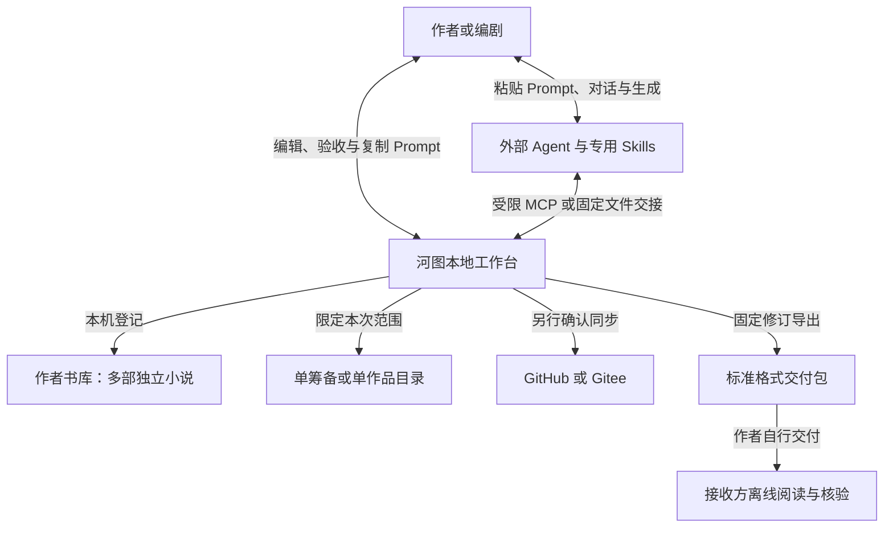
```mermaid
flowchart TB
    author["作者或编剧"] <-->|"编辑、验收与复制 Prompt"| hetu["河图本地工作台"]
    author <-->|"粘贴 Prompt、对话与生成"| host["外部 Agent 与专用 Skills"]
    host <-->|"受限 MCP 或固定文件交接"| hetu
    hetu -->|"本机登记"| library["作者书库：多部独立小说"]
    hetu -->|"限定本次范围"| content["单筹备或单作品目录"]
    hetu -->|"另行确认同步"| remote["GitHub 或 Gitee"]
    hetu -->|"固定修订导出"| bundle["标准格式交付包"]
    bundle -->|"作者自行交付"| recipient["接收方离线阅读与核验"]
```

本图将河图作为一个产品系统，内部模块见第2节，独立进程和通道见第21节。河图不调用外部 Agent 生成、不代用户进行对话。Node.js 页面是按需辅助入口，MCP Apps 是宿主内的交互载体；二者均不替代原生创作软件或保存第二套作品事实。书库登记不合并作品目录，也不自动创建共同 IP。

## 2. 内部组件与依赖

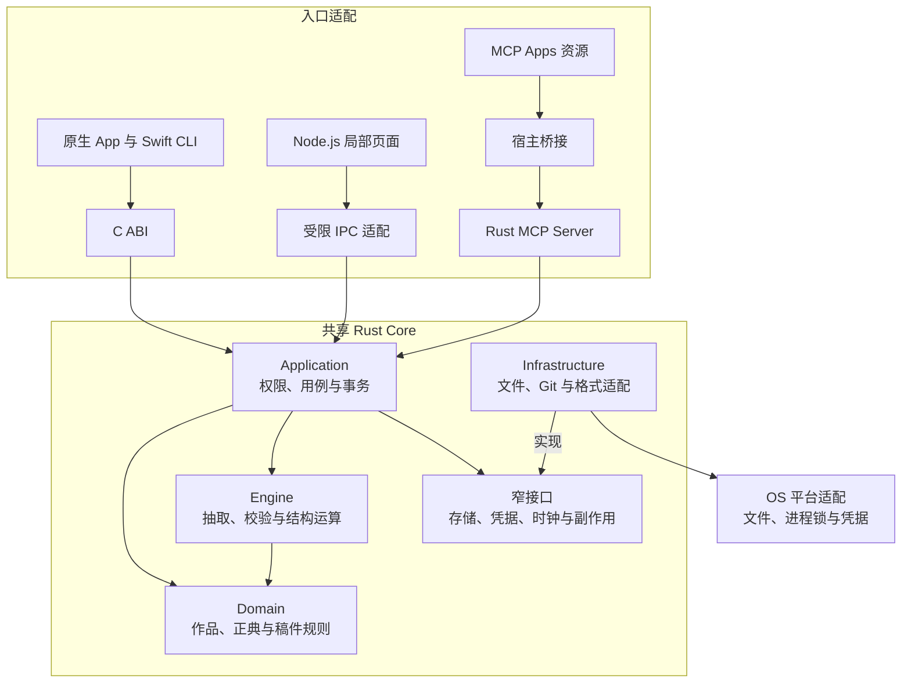
```mermaid
flowchart TD
    subgraph entry["入口适配"]
        native["原生 App 与 Swift CLI"] --> abi["C ABI"]
        mcp["Rust MCP Server"]
        web["Node.js 局部页面"] --> ipc["受限 IPC 适配"]
        appUi["MCP Apps 资源"] --> hostBridge["宿主桥接"]
        hostBridge --> mcp
    end
    subgraph kernel["共享 Rust Core"]
        application["Application<br/>权限、用例与事务"]
        domain["Domain<br/>作品、正典与稿件规则"]
        engine["Engine<br/>抽取、校验与结构运算"]
        ports["窄接口<br/>存储、凭据、时钟与副作用"]
        infrastructure["Infrastructure<br/>文件、Git 与格式适配"]
        application --> domain
        application --> engine
        application --> ports
        engine --> domain
        infrastructure -->|"实现"| ports
    end
    abi --> application
    mcp --> application
    ipc --> application
    infrastructure --> os["OS 平台适配<br/>文件、进程锁与凭据"]
```

图中表示源码依赖，不表示领域对象直接读写磁盘。应用层在入口组合时获得基础设施实现，领域与规则运算只消费显式输入；只在实际外部边界使用窄接口。SwiftUI/AppKit、WinUI 3 和共享 CLI 的平台分工见03，运行进程与通道见第21节。

## 3. 首次使用与客户端接入流程

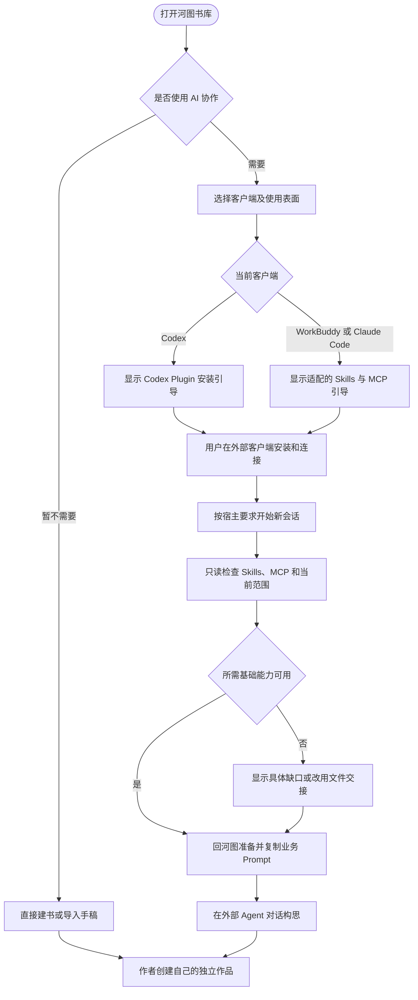
```mermaid
flowchart TD
    start(["打开河图书库"]) --> mode{"是否使用 AI 协作"}
    mode -->|"暂不需要"| manual["直接建书或导入手稿"]
    mode -->|"需要"| choose["选择客户端及使用表面"]
    choose --> type{"当前客户端"}
    type -->|"Codex"| plugin["显示 Codex Plugin 安装引导"]
    type -->|"WorkBuddy 或 Claude Code"| skills["显示适配的 Skills 与 MCP 引导"]
    plugin --> install["用户在外部客户端安装和连接"]
    skills --> install
    install --> newSession["按宿主要求开始新会话"]
    newSession --> check["只读检查 Skills、MCP 和当前范围"]
    check --> usable{"所需基础能力可用"}
    usable -->|"是"| task["回河图准备并复制业务 Prompt"]
    usable -->|"否"| resolve["显示具体缺口或改用文件交接"]
    resolve --> task
    manual --> book["作者创建自己的独立作品"]
    task --> concept["在外部 Agent 对话构思"]
    concept --> book
```

客户端安装、用户确认完成和实际连接检查分别记录。选择某品牌不自动证明 Apps、浏览器、图像或本机文件能力可用。

## 4. 建书与封面业务流程

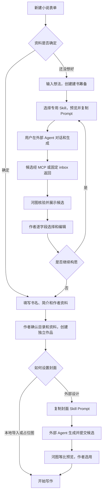
```mermaid
flowchart TD
    newBook["新建小说表单"] --> known{"资料是否确定"}
    known -->|"确定"| form["填写书名、简介和作者资料"]
    known -->|"还没想好"| idea["输入想法，创建建书筹备"]
    idea --> prompt["选择专用 Skill，预览并复制 Prompt"]
    prompt --> external["用户在外部 Agent 对话和生成"]
    external --> result["候选经 MCP 或固定 inbox 返回"]
    result --> verify["河图核验并展示候选"]
    verify --> choose["作者逐字段选择和编辑"]
    choose --> satisfied{"是否继续构思"}
    satisfied -->|"是"| prompt
    satisfied -->|"否"| form
    form --> create["作者确认目录和资料，创建独立作品"]
    create --> cover{"如何设置封面"}
    cover -->|"本地导入或占位图"| write["开始写作"]
    cover -->|"外部设计"| coverPrompt["复制封面 Skill Prompt"]
    coverPrompt --> coverAgent["外部 Agent 生成并提交候选"]
    coverAgent --> preview["河图等比预览，作者选用"]
    preview --> write
```

筹备阶段可以探索封面；进入正式作品前不写 BookCover。创建失败保留筹备，重复原请求只返回同一本书，不能因网络或窗口重开复制创建。

## 5. 接入时序

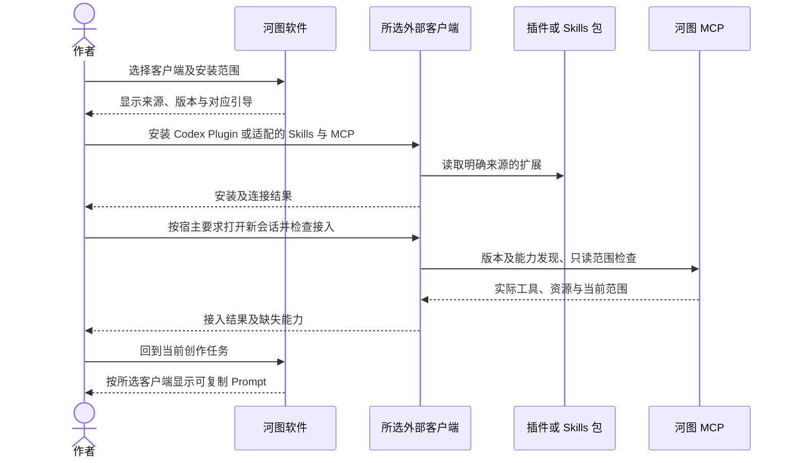
```mermaid
sequenceDiagram
    actor author as 作者
    participant desktop as 河图软件
    participant host as 所选外部客户端
    participant package as 插件或 Skills 包
    participant server as 河图 MCP
    author->>desktop: 选择客户端及安装范围
    desktop-->>author: 显示来源、版本与对应引导
    author->>host: 安装 Codex Plugin 或适配的 Skills 与 MCP
    host->>package: 读取明确来源的扩展
    host-->>author: 安装及连接结果
    author->>host: 按宿主要求打开新会话并检查接入
    host->>server: 版本及能力发现、只读范围检查
    server-->>host: 实际工具、资源与当前范围
    host-->>author: 接入结果及缺失能力
    author->>desktop: 回到当前创作任务
    desktop-->>author: 按所选客户端显示可复制 Prompt
```

MCP `2026-07-28` 采用 `server/discover` 与每请求元数据，legacy 宿主使用独立适配；图中不将两套握手混为同一协议。河图不自动安装用户的 Agent 或启动生成对话。

## 6. 建书构思与候选回传时序

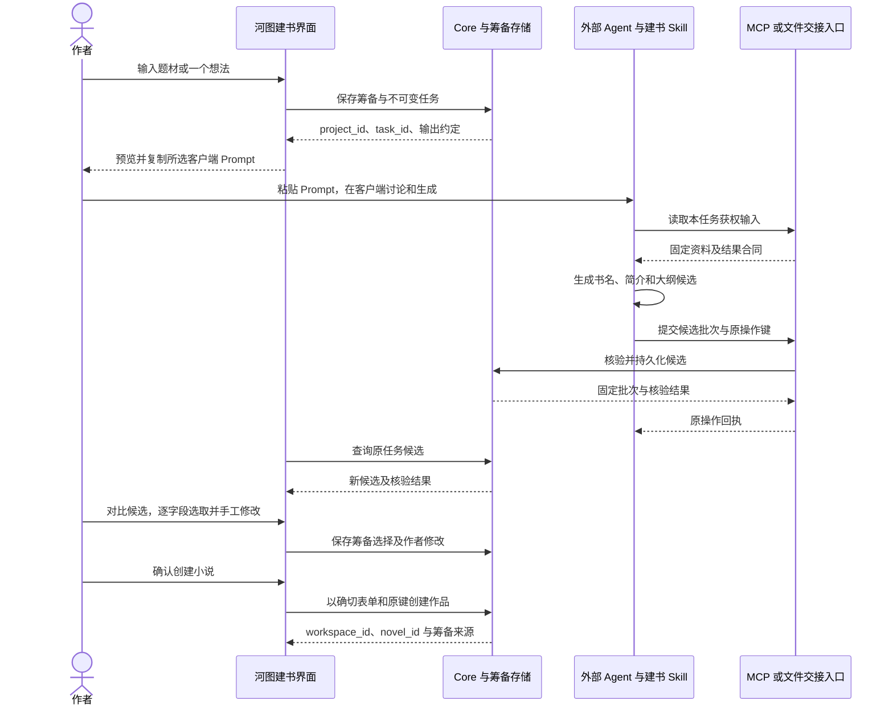
```mermaid
sequenceDiagram
    actor author as 作者
    participant desktop as 河图建书界面
    participant core as Core 与筹备存储
    participant host as 外部 Agent 与建书 Skill
    participant server as MCP 或文件交接入口
    author->>desktop: 输入题材或一个想法
    desktop->>core: 保存筹备与不可变任务
    core-->>desktop: project_id、task_id、输出约定
    desktop-->>author: 预览并复制所选客户端 Prompt
    author->>host: 粘贴 Prompt，在客户端讨论和生成
    host->>server: 读取本任务获权输入
    server-->>host: 固定资料及结果合同
    host->>host: 生成书名、简介和大纲候选
    host->>server: 提交候选批次与原操作键
    server->>core: 核验并持久化候选
    core-->>server: 固定批次与核验结果
    server-->>host: 原操作回执
    desktop->>core: 查询原任务候选
    core-->>desktop: 新候选及核验结果
    author->>desktop: 对比候选，逐字段选取并手工修改
    desktop->>core: 保存筹备选择及作者修改
    author->>desktop: 确认创建小说
    desktop->>core: 以确切表单和原键创建作品
    core-->>desktop: workspace_id、novel_id 与筹备来源
```

没有 workspace 时只允许筹备 scope；Agent 不因此获得书库位置或其他小说。复制、生成、候选保存和创建作品分别有结果。

## 7. 已有作品的参考稿协作时序

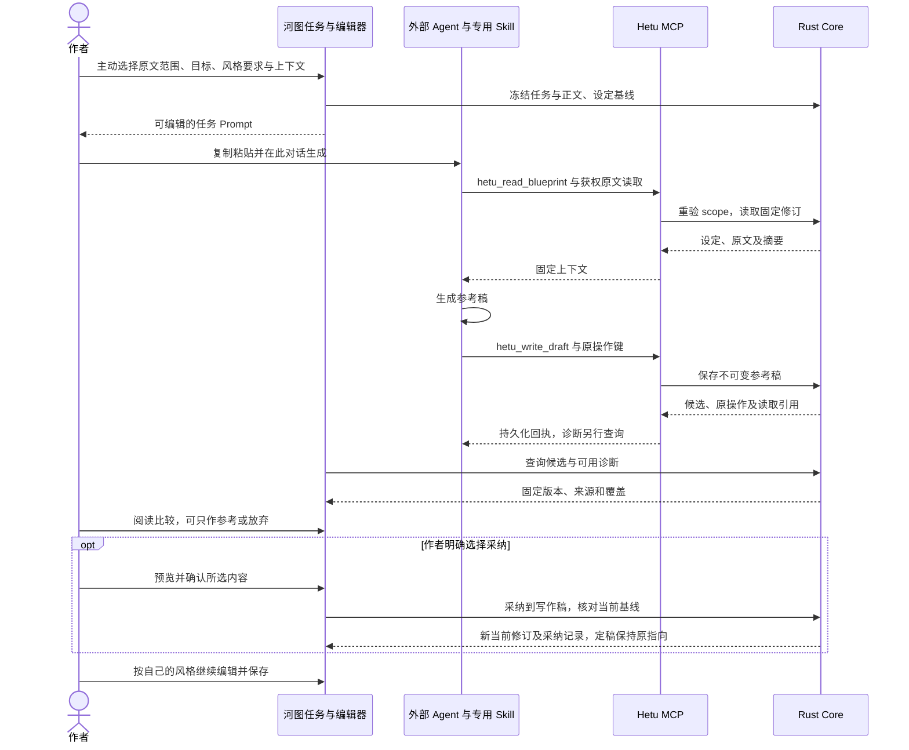
```mermaid
sequenceDiagram
    actor author as 作者
    participant desktop as 河图任务与编辑器
    participant host as 外部 Agent 与专用 Skill
    participant server as Hetu MCP
    participant core as Rust Core
    author->>desktop: 主动选择原文范围、目标、风格要求与上下文
    desktop->>core: 冻结任务与正文、设定基线
    desktop-->>author: 可编辑的任务 Prompt
    author->>host: 复制粘贴并在此对话生成
    host->>server: hetu_read_blueprint 与获权原文读取
    server->>core: 重验 scope，读取固定修订
    core-->>server: 设定、原文及摘要
    server-->>host: 固定上下文
    host->>host: 生成参考稿
    host->>server: hetu_write_draft 与原操作键
    server->>core: 保存不可变参考稿
    core-->>server: 候选、原操作及读取引用
    server-->>host: 持久化回执，诊断另行查询
    desktop->>core: 查询候选与可用诊断
    core-->>desktop: 固定版本、来源和覆盖
    author->>desktop: 阅读比较，可只作参考或放弃
    opt 作者明确选择采纳
        author->>desktop: 预览并确认所选内容
        desktop->>core: 采纳到写作稿，核对当前基线
        core-->>desktop: 新当前修订及采纳记录，定稿保持原指向
    end
    author->>desktop: 按自己的风格继续编辑并保存
```

本流程由作者按需进入，不是编辑或定稿的前置。接收候选只更新参考列表，不改作者正文、未保存缓冲或编辑焦点；作者可参照后自行改写，无需采纳。源文变化时进入三方比较，不自动把旧候选覆盖到新正文。要求 Agent 重写时由河图提供补充 Prompt，作者复制到客户端继续；资源通知不自动运行模型。

## 8. MCP Apps 局部交互时序

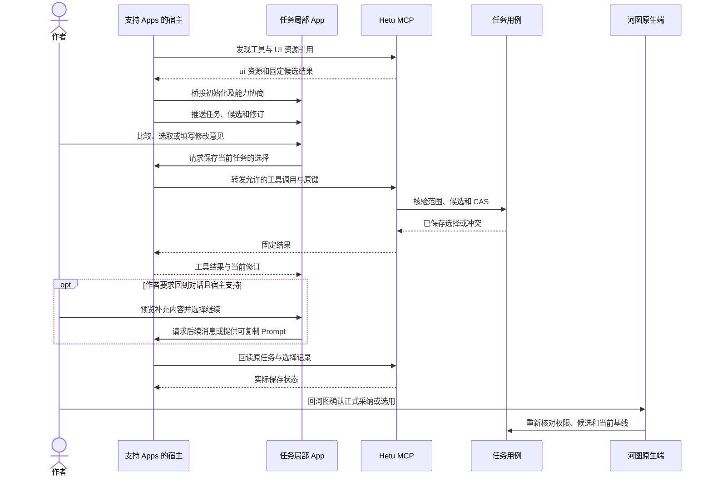
```mermaid
sequenceDiagram
    actor author as 作者
    participant host as 支持 Apps 的宿主
    participant app as 任务局部 App
    participant server as Hetu MCP
    participant core as 任务用例
    participant desktop as 河图原生端
    host->>server: 发现工具与 UI 资源引用
    server-->>host: ui 资源和固定候选结果
    host->>app: 桥接初始化及能力协商
    host->>app: 推送任务、候选和修订
    author->>app: 比较、选取或填写修改意见
    app->>host: 请求保存当前任务的选择
    host->>server: 转发允许的工具调用与原键
    server->>core: 核验范围、候选和 CAS
    core-->>server: 已保存选择或冲突
    server-->>host: 固定结果
    host-->>app: 工具结果与当前修订
    opt 作者要求回到对话且宿主支持
        author->>app: 预览补充内容并选择继续
        app->>host: 请求后续消息或提供可复制 Prompt
    end
    host->>server: 回读原任务与选择记录
    server-->>host: 实际保存状态
    author->>desktop: 回河图确认正式采纳或选用
    desktop->>core: 重新核对权限、候选和当前基线
```

App 选择不等于正文定稿。Apps 不可用时同一候选在河图显示，不能丢失结果或强制更换客户端。

## 9. 按需本地网页与浏览器时序

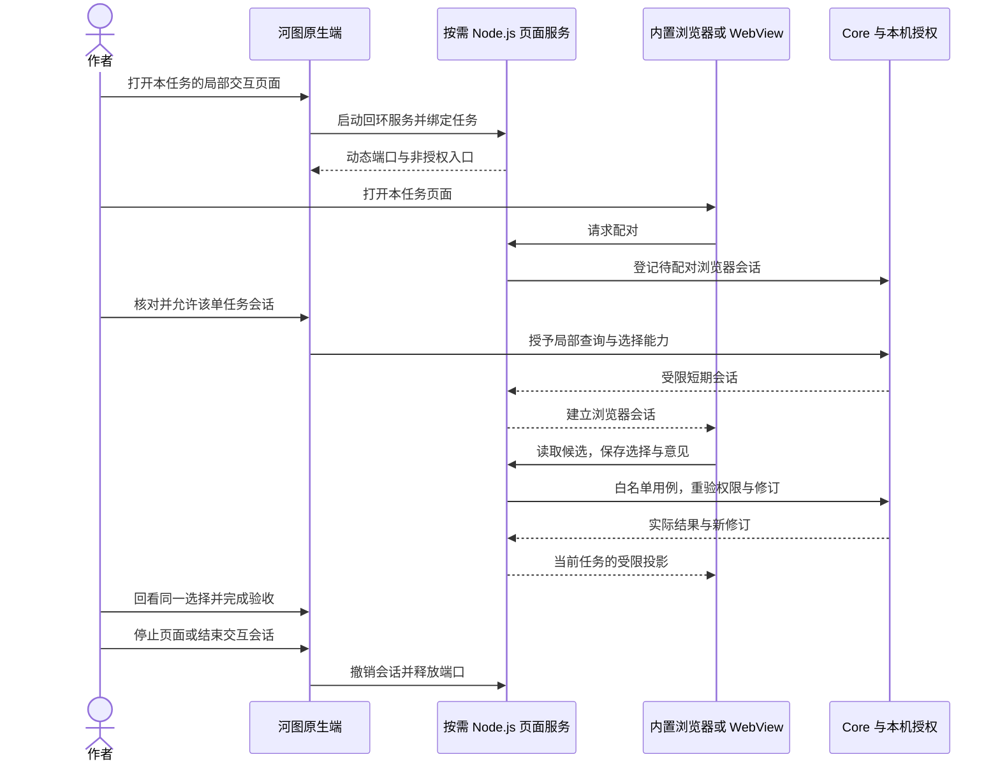
```mermaid
sequenceDiagram
    actor author as 作者
    participant desktop as 河图原生端
    participant node as 按需 Node.js 页面服务
    participant browser as 内置浏览器或 WebView
    participant core as Core 与本机授权
    author->>desktop: 打开本任务的局部交互页面
    desktop->>node: 启动回环服务并绑定任务
    node-->>desktop: 动态端口与非授权入口
    author->>browser: 打开本任务页面
    browser->>node: 请求配对
    node->>core: 登记待配对浏览器会话
    author->>desktop: 核对并允许该单任务会话
    desktop->>core: 授予局部查询与选择能力
    core-->>node: 受限短期会话
    node-->>browser: 建立浏览器会话
    browser->>node: 读取候选，保存选择与意见
    node->>core: 白名单用例，重验权限与修订
    core-->>node: 实际结果与新修订
    node-->>browser: 当前任务的受限投影
    author->>desktop: 回看同一选择并完成验收
    author->>desktop: 停止页面或结束交互会话
    desktop->>node: 撤销会话并释放端口
```

页面不假设能读取宿主文件或 `window.openai`。浏览器自动化不能代替原生作者批准；云端浏览器不可达本机时回退原生界面，不自动开公网隧道。

## 10. 参考稿审核状态

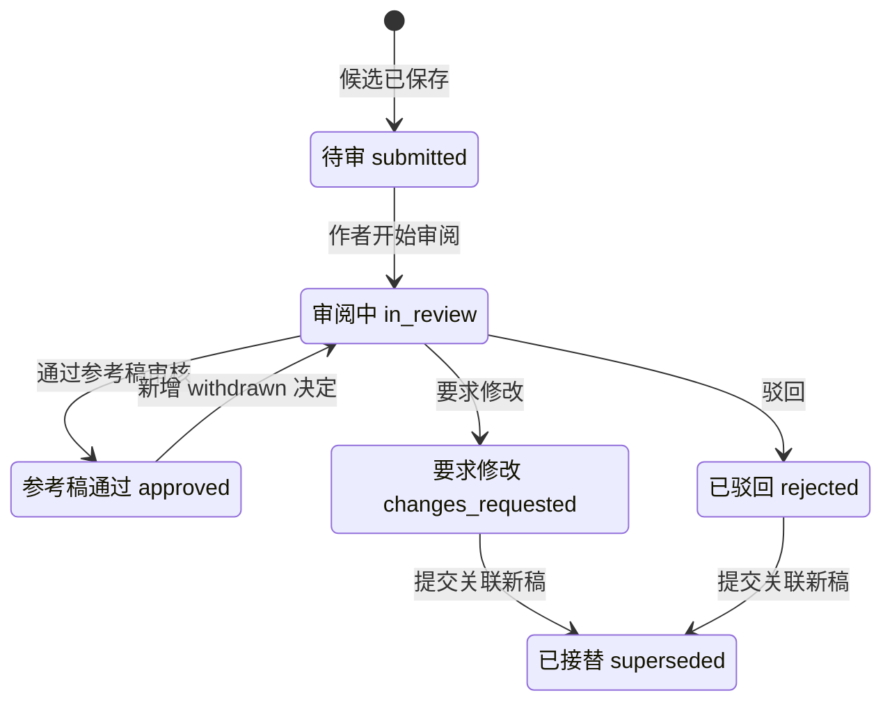
```mermaid
stateDiagram-v2
    state "待审 submitted" as submitted
    state "审阅中 in_review" as inReview
    state "参考稿通过 approved" as approved
    state "要求修改 changes_requested" as changesRequested
    state "已驳回 rejected" as rejected
    state "已接替 superseded" as superseded
    [*] --> submitted: 候选已保存
    submitted --> inReview: 作者开始审阅
    inReview --> approved: 通过参考稿审核
    inReview --> changesRequested: 要求修改
    inReview --> rejected: 驳回
    changesRequested --> superseded: 提交关联新稿
    rejected --> superseded: 提交关联新稿
    approved --> inReview: 新增 withdrawn 决定
```

`inReview` 等图名映射 Draft 的 snake_case 状态。`withdrawn` 是审核决定，撤回后状态为 `in_review`，不是 `submitted`，也不是新增的 Draft 状态。所有状态均保留原候选与决定；撤回审核不撤销已发生的采纳。`approved` 不等于定稿，作者采纳另写 AdoptionRecord；审核上下文是否过期是计算状态，不新增持久枚举。返工时旧稿变为 `superseded`，新 draft ID 从 `submitted` 开始，不能在原记录上替换正文。

## 11. 写作、采纳与独立定稿流程

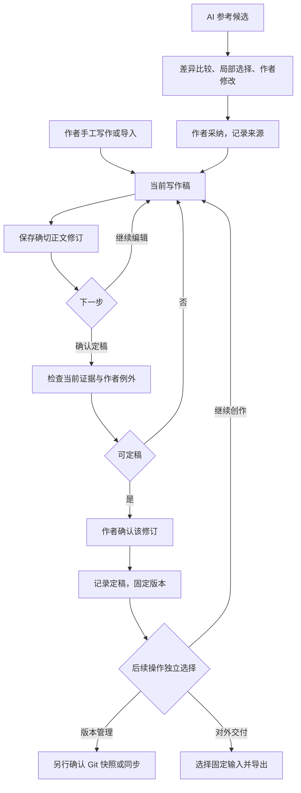
```mermaid
flowchart TD
    manual["作者手工写作或导入"] --> writing["当前写作稿"]
    candidate["AI 参考候选"] --> compare["差异比较、局部选择、作者修改"]
    compare --> adopt["作者采纳，记录来源"]
    adopt --> writing
    writing --> save["保存确切正文修订"]
    save --> edit{"下一步"}
    edit -->|"继续编辑"| writing
    edit -->|"确认定稿"| check["检查当前证据与作者例外"]
    check --> valid{"可定稿"}
    valid -->|"否"| writing
    valid -->|"是"| confirm["作者确认该修订"]
    confirm --> final["记录定稿，固定版本"]
    final --> next{"后续操作独立选择"}
    next -->|"继续创作"| writing
    next -->|"版本管理"| git["另行确认 Git 快照或同步"]
    next -->|"对外交付"| export["选择固定输入并导出"]
```

编辑新稿不会抹除旧定稿，采纳参考稿不会更新定稿指针，软件不自动向投稿平台发稿。

## 12. 定稿与撤回时序

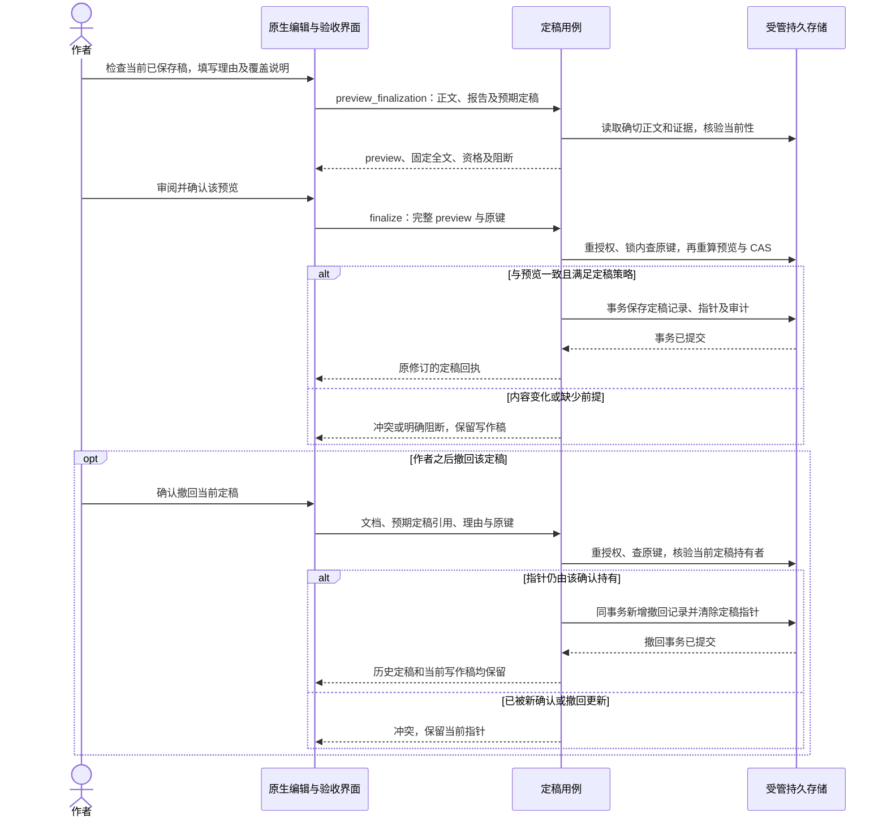
```mermaid
sequenceDiagram
    actor author as 作者
    participant editor as 原生编辑与验收界面
    participant core as 定稿用例
    participant storage as 受管持久存储
    author->>editor: 检查当前已保存稿，填写理由及覆盖说明
    editor->>core: preview_finalization：正文、报告及预期定稿
    core->>storage: 读取确切正文和证据，核验当前性
    core-->>editor: preview、固定全文、资格及阻断
    author->>editor: 审阅并确认该预览
    editor->>core: finalize：完整 preview 与原键
    core->>storage: 重授权、锁内查原键，再重算预览与 CAS
    alt 与预览一致且满足定稿策略
        core->>storage: 事务保存定稿记录、指针及审计
        storage-->>core: 事务已提交
        core-->>editor: 原修订的定稿回执
    else 内容变化或缺少前提
        core-->>editor: 冲突或明确阻断，保留写作稿
    end
    opt 作者之后撤回该定稿
        author->>editor: 确认撤回当前定稿
        editor->>core: 文档、预期定稿引用、理由与原键
        core->>storage: 重授权、查原键，核验当前定稿持有者
        alt 指针仍由该确认持有
            core->>storage: 同事务新增撤回记录并清除定稿指针
            storage-->>core: 撤回事务已提交
            core-->>editor: 历史定稿和当前写作稿均保留
        else 已被新确认或撤回更新
            core-->>editor: 冲突，保留当前指针
        end
    end
```

## 13. 原操作与断线恢复

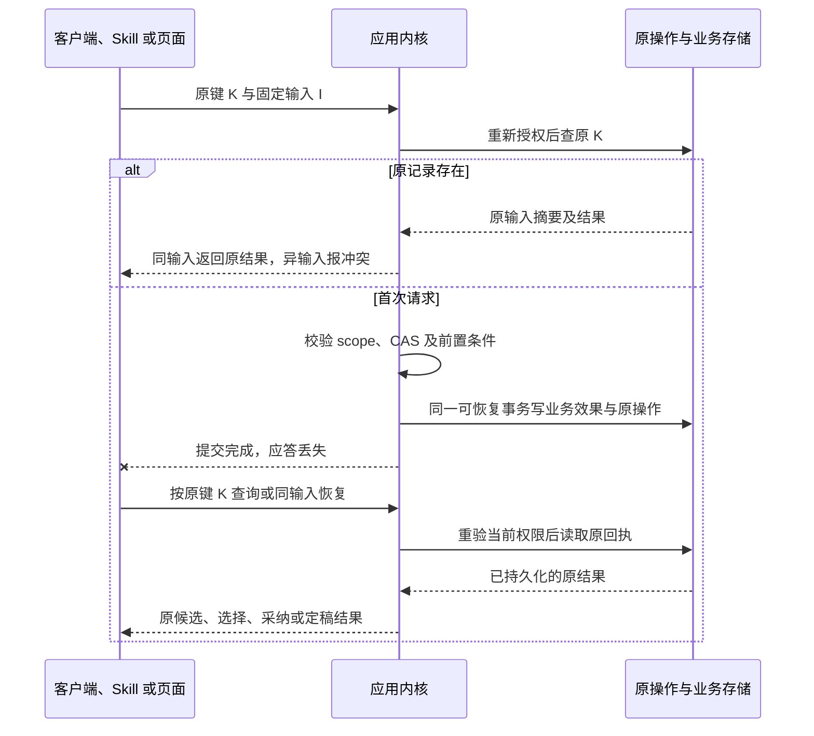
```mermaid
sequenceDiagram
    participant client as 客户端、Skill 或页面
    participant core as 应用内核
    participant disk as 原操作与业务存储
    client->>core: 原键 K 与固定输入 I
    core->>disk: 重新授权后查原 K
    alt 原记录存在
        disk-->>core: 原输入摘要及结果
        core-->>client: 同输入返回原结果，异输入报冲突
    else 首次请求
        core->>core: 校验 scope、CAS 及前置条件
        core->>disk: 同一可恢复事务写业务效果与原操作
        core--xclient: 提交完成，应答丢失
        client->>core: 按原键 K 查询或同输入恢复
        core->>disk: 重验当前权限后读取原回执
        disk-->>core: 已持久化的原结果
        core-->>client: 原候选、选择、采纳或定稿结果
    end
```

关闭 Apps、网页或软件只影响观察；不自动取消外部生成、退款或换键重试。外部生成结果未知时先核对原任务和已有文件。

## 14. 标准格式交付流程

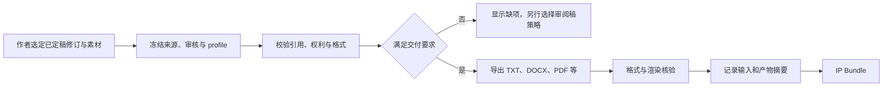
```mermaid
flowchart LR
    select["作者选定已定稿修订与素材"] --> freeze["冻结来源、审核与 profile"]
    freeze --> check["校验引用、权利与格式"]
    check --> valid{"满足交付要求"}
    valid -->|"否"| gaps["显示缺项，另行选择审阅稿策略"]
    valid -->|"是"| render["导出 TXT、DOCX、PDF 等"]
    render --> inspect["格式与渲染核验"]
    inspect --> manifest["记录输入和产物摘要"]
    manifest --> bundle["IP Bundle"]
```

默认不混入 AI 参考稿、私密批注和未定稿内容；作者显式导出审阅材料时清楚标识。导出不是自动发稿、上传或发送给制片方。

## 15. Git 同步与冲突流程

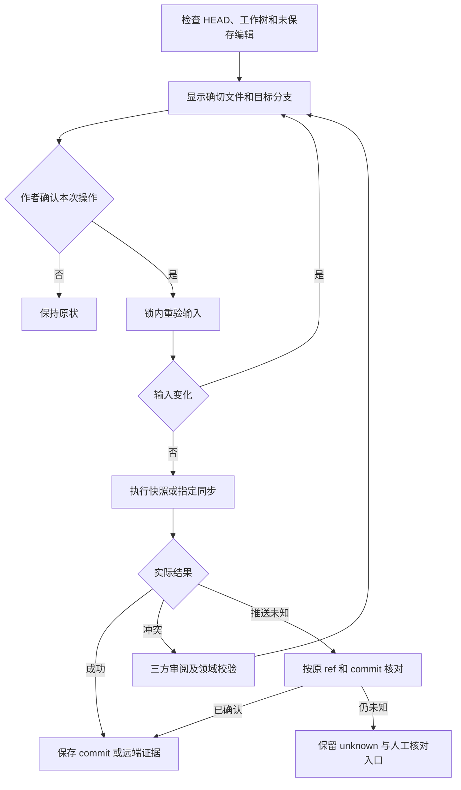
```mermaid
flowchart TD
    status["检查 HEAD、工作树和未保存编辑"] --> preview["显示确切文件和目标分支"]
    preview --> confirm{"作者确认本次操作"}
    confirm -->|"否"| stop["保持原状"]
    confirm -->|"是"| recheck["锁内重验输入"]
    recheck --> changed{"输入变化"}
    changed -->|"是"| preview
    changed -->|"否"| execute["执行快照或指定同步"]
    execute --> result{"实际结果"}
    result -->|"成功"| receipt["保存 commit 或远端证据"]
    result -->|"冲突"| resolve["三方审阅及领域校验"]
    resolve --> preview
    result -->|"推送未知"| query["按原 ref 和 commit 核对"]
    query -->|"已确认"| receipt
    query -->|"仍未知"| unknown["保留 unknown 与人工核对入口"]
```

## 16. 作者书库与多作品切换

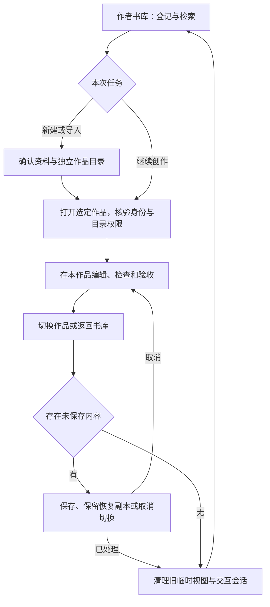
```mermaid
flowchart TD
    library["作者书库：登记与检索"] --> choose{"本次任务"}
    choose -->|"新建或导入"| create["确认资料与独立作品目录"]
    create --> open["打开选定作品，核验身份与目录权限"]
    choose -->|"继续创作"| open
    open --> work["在本作品编辑、检查和验收"]
    work --> switch["切换作品或返回书库"]
    switch --> buffer{"存在未保存内容"}
    buffer -->|"有"| resolve["保存、保留恢复副本或取消切换"]
    resolve -->|"取消"| work
    resolve -->|"已处理"| clear["清理旧临时视图与交互会话"]
    buffer -->|"无"| clear
    clear --> library
```

书库仅持有本机登记与可重建摘要，不合并作品正文或设定。打开另一部作品须独立核验权限；旧 Agent 会话不自动获得新作品范围，旧任务和候选仍留在原作品。

## 17. 分卷与章节管理

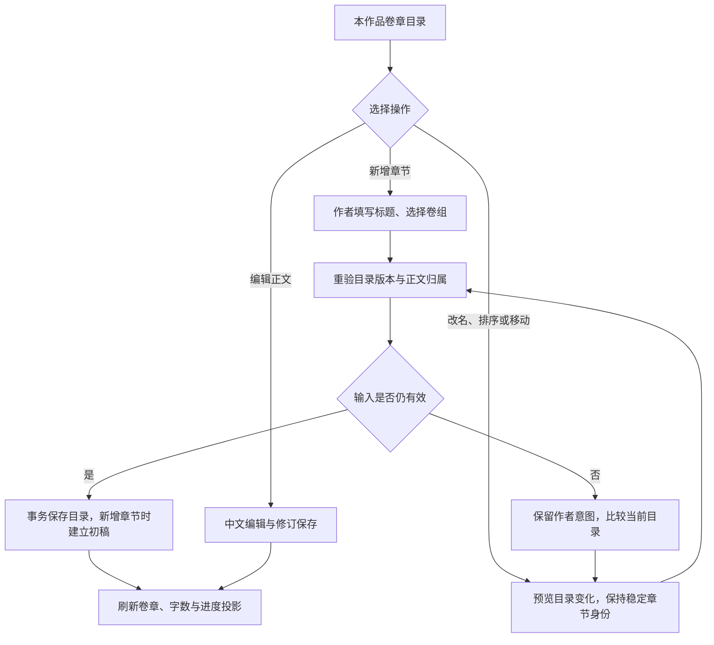
```mermaid
flowchart TD
    tree["本作品卷章目录"] --> action{"选择操作"}
    action -->|"新增章节"| new["作者填写标题、选择卷组"]
    new --> cas
    action -->|"改名、排序或移动"| preview["预览目录变化，保持稳定章节身份"]
    preview --> cas["重验目录版本与正文归属"]
    cas --> result{"输入是否仍有效"}
    save["事务保存目录，新增章节时建立初稿"]
    result -->|"是"| save
    result -->|"否"| reload["保留作者意图，比较当前目录"]
    reload --> preview
    action -->|"编辑正文"| edit["中文编辑与修订保存"]
    save --> view["刷新卷章、字数与进度投影"]
    edit --> view
```

章节改名、重排和跨卷移动不改变 document ID，不把显示序号写成引用身份，不创建正文修订或删除既有正文／定稿。新增章节与目录登记须同一可恢复事务完成，不能出现目录有章但正文缺失。

## 18. 短剧项目与剧本管理

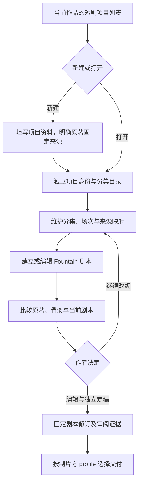
```mermaid
flowchart TD
    projects["当前作品的短剧项目列表"] --> select{"新建或打开"}
    select -->|"新建"| source["填写项目资料，明确原著固定来源"]
    source --> project["独立项目身份与分集目录"]
    select -->|"打开"| project
    project --> structure["维护分集、场次与来源映射"]
    structure --> script["建立或编辑 Fountain 剧本"]
    script --> compare["比较原著、骨架与当前剧本"]
    compare --> next{"作者决定"}
    next -->|"继续改编"| structure
    next -->|"编辑与独立定稿"| final["固定剧本修订及审阅证据"]
    final --> export["按制片方 profile 选择交付"]
```

同一小说的不同改编项目各自保存分集、场次及剧本引用；重建结构产生候选，不覆盖已有人工编排。书库作品、短剧项目、剧本文档和分集编号是不同层级，不能用项目名称或集号互相替代。

## 19. 小说到短剧的结构化时序

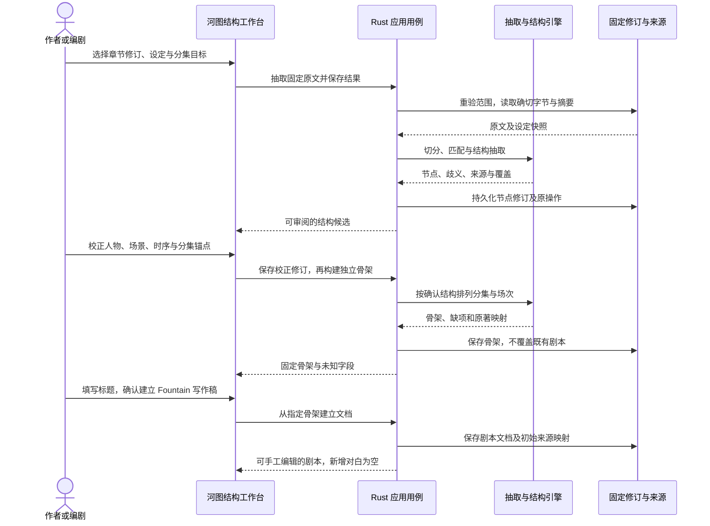
```mermaid
sequenceDiagram
    actor author as 作者或编剧
    participant desktop as 河图结构工作台
    participant core as Rust 应用用例
    participant engine as 抽取与结构引擎
    participant storage as 固定修订与来源
    author->>desktop: 选择章节修订、设定与分集目标
    desktop->>core: 抽取固定原文并保存结果
    core->>storage: 重验范围，读取确切字节与摘要
    storage-->>core: 原文及设定快照
    core->>engine: 切分、匹配与结构抽取
    engine-->>core: 节点、歧义、来源与覆盖
    core->>storage: 持久化节点修订及原操作
    core-->>desktop: 可审阅的结构候选
    author->>desktop: 校正人物、场景、时序与分集锚点
    desktop->>core: 保存校正修订，再构建独立骨架
    core->>engine: 按确认结构排列分集与场次
    engine-->>core: 骨架、缺项和原著映射
    core->>storage: 保存骨架，不覆盖既有剧本
    core-->>desktop: 固定骨架与未知字段
    author->>desktop: 填写标题，确认建立 Fountain 写作稿
    desktop->>core: 从指定骨架建立文档
    core->>storage: 保存剧本文档及初始来源映射
    core-->>desktop: 可手工编辑的剧本，新增对白为空
```

抽取整理已有内容，不补因果、对白或镜头。外部 Agent 辅助填稿沿第7节参考稿路径交接；原著变化后映射显示过期，作者决定是否重新比较与更新。

## 20. 诊断、证据定位与作者处置

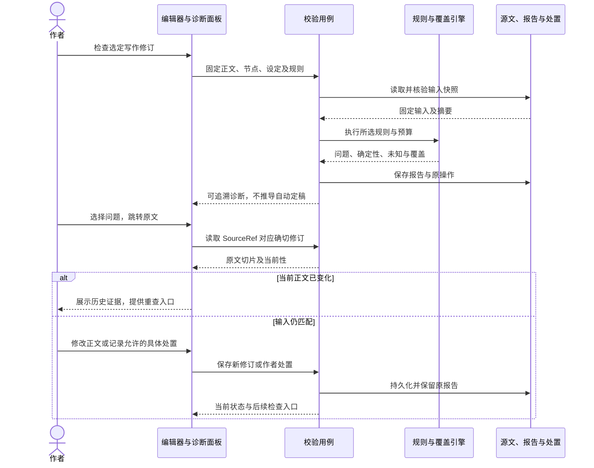
```mermaid
sequenceDiagram
    actor author as 作者
    participant desktop as 编辑器与诊断面板
    participant core as 校验用例
    participant engine as 规则与覆盖引擎
    participant storage as 源文、报告与处置
    author->>desktop: 检查选定写作修订
    desktop->>core: 固定正文、节点、设定及规则
    core->>storage: 读取并核验输入快照
    storage-->>core: 固定输入及摘要
    core->>engine: 执行所选规则与预算
    engine-->>core: 问题、确定性、未知与覆盖
    core->>storage: 保存报告与原操作
    core-->>desktop: 可追溯诊断，不推导自动定稿
    author->>desktop: 选择问题，跳转原文
    desktop->>core: 读取 SourceRef 对应确切修订
    core-->>desktop: 原文切片及当前性
    alt 当前正文已变化
        desktop-->>author: 展示历史证据，提供重查入口
    else 输入仍匹配
        author->>desktop: 修改正文或记录允许的具体处置
        desktop->>core: 保存新修订或作者处置
        core->>storage: 持久化并保留原报告
        core-->>desktop: 当前状态与后续检查入口
    end
```

诊断完整性、规则结论与作者决定分别显示。源文定位不把历史字节范围直接套到新稿；业务例外不修改机器结论，数据损坏与无效引用不能豁免。

## 21. 运行部署与信任边界

```mermaid
flowchart TB
    host["外部宿主：Agent、Skills 与隔离的 Apps"]
    browser["可达本机的浏览器或 WebView"]
    subgraph nativeProcess["原生 App 进程：作者编辑与确认"]
        nativeUi["SwiftUI 或 WinUI 3"] -->|"C ABI"| nativeCore["进程内 Rust Core"]
        restrictedIpc["单任务 IPC 白名单入口"] --> nativeCore
    end
    subgraph cliProcess["独立 CLI 进程"]
        cliEntry["Swift 薄入口"] -->|"C ABI"| cliCore["进程内 Rust Core"]
    end
    subgraph mcpProcess["独立 MCP 进程"]
        mcpEntry["Rust stdio 适配"] --> mcpCore["进程内 Rust Core"]
    end
    nativeUi -.->|"按需启停和作者配对"| node["Node.js 页面进程"]
    browser -->|"已配对回环 HTTP"| node
    node -->|"受限 IPC"| restrictedIpc
    host -->|"stdio 与受限工具"| mcpEntry
    nativeCore --> data["受管目录：单筹备或单作品"]
    cliCore --> data
    mcpCore --> data
    nativeUi --> localData["本机书库、偏好与作者批准"]
```

三个 Core 框表示同一业务实现链接进不同入口进程，不是三个业务服务或三份数据库。每个 Core 均执行授权、范围锁、CAS 和恢复协议，受管读取不会跳过这些检查；同目录的并发由 OS 锁和版本核验协调。Node.js 只代理发起它的应用会话内的受限用例，不能转发作者句柄或任意动作。IPC 的具体传输依实现合同确定，不从本图推导固定端口或全局 RPC 服务。

CLI 与 MCP 可在桌面退出后独立执行已获权用例；局部页面随发起它的应用会话结束而撤销。读原回执仍重新授权，Apps 或网页的点击不能变成作者管理权限。Git 远端属于第1节的外部系统，凭据经平台适配使用，不进入内容目录、MCP 或网页。外部 Agent 若另有直接磁盘权限，仍可能绕过受管 API；摘要和读取校验用于发现改写，不宣称 OS 沙箱隔离。

## 22. 中文编辑、保存与并发冲突时序

```mermaid
sequenceDiagram
    actor author as 作者
    participant editor as 原生中文编辑器
    participant recovery as 本机缓冲恢复
    participant core as 保存用例
    participant store as 工作区事务存储
    author->>editor: 中文输入、撤销或粘贴
    editor->>recovery: 保存可恢复缓冲及所基于修订
    author->>editor: 保存当前稿
    alt 存在输入法组合
        editor-->>author: 等待组合结束，保留焦点和选区
    else 组合结束且可提交
        editor->>core: 文档、基线修订、原始内容与原键
        core->>store: 重新授权、锁内查原键并核对 CAS
        alt 基线与当前一致
            core->>store: 同事务保存新修订、清单、原操作和审计
            store-->>core: 已提交的确切修订及摘要
            core-->>editor: 保存成功，定稿指针保持
            editor->>recovery: 关联已确认修订，保留更新中的后续缓冲
        else 其他窗口或进程已保存
            core-->>editor: 冲突及当前修订引用
            editor-->>author: 保留本地缓冲，比较基线、当前与本地稿
            author->>editor: 选择合并内容或放弃本次覆盖
            Note over editor,core: 合并后重新预览并以新基线保存，不静默重试覆盖
        end
    end
```

本机缓冲不等于正文修订，保存修订不等于定稿。UTF-16 选区必须转换成原始 UTF-8 边界，CRLF 不因展示而被静默规范化。写入后回执丢失按第13节查询原键；只有原回执确认的内容才显示为已保存。

## 23. 写作稿与定稿的组合状态

以下是 `current_revision_id`、有效定稿指针及编辑缓冲的界面投影，不新增一个同时管理来源、审核和发稿的持久状态字段。

```mermaid
stateDiagram-v2
    state "写作稿，无定稿" as writingOnly
    state "当前稿已定稿" as currentFinal
    state "新写作稿与旧定稿" as newerWriting
    [*] --> writingOnly: 新建、导入或手工保存
    writingOnly --> currentFinal: 独立定稿
    currentFinal --> newerWriting: 保存新修订
    newerWriting --> currentFinal: 新修订独立定稿
    currentFinal --> writingOnly: 撤回当前定稿
    newerWriting --> writingOnly: 撤回旧定稿
```

| 独立维度 | 显示规则 | 不改变的事实 |
| --- | --- | --- |
| 未保存缓冲 | 在上述任一状态叠加“未保存／保存失败／冲突” | 定稿仍指向已确认修订，不包含缓冲 |
| 诊断或设定已变化 | 显示证据过期及重新检查入口 | 历史定稿和原报告保留，不能自动撤回作者决定 |
| AI 来源 | 按实际候选、采纳及修订关联显示 | 手工改写不抹除历史，也不由风格推断 AI 比例 |
| 已导出 | 显示 Bundle 固定输入及导出时间 | 不代表已发布，也不会随新修订自动更新包 |

采纳参考内容也属于保存新修订：无定稿时仍是“写作稿，无定稿”，已有定稿时成为“新写作稿与旧定稿”；在该状态继续保存不会改变旧定稿。撤回动作只针对仍持有当前指针的记录。

## 24. 依赖变化与证据当前性

```mermaid
flowchart TD
    change["收到受管变更或发现外部改写"] --> integrity{"历史文件与摘要完整"}
    integrity -->|"否"| block["完整性阻断：保留证据并进入诊断"]
    integrity -->|"是"| deps["比较固定输入与当前依赖"]
    deps --> content["正文或设定修订变化"]
    deps --> structure["节点、骨架或规则版本变化"]
    deps --> presentation["语言、显示排版或目录顺序变化"]
    content --> stale["相关报告、源映射或定稿资格过期"]
    structure --> stale
    presentation --> affected["仅刷新实际依赖的排序、模板或界面投影"]
    stale --> history["保留历史修订、证据与作者决定"]
    history --> action["作者选择重查、重新映射或独立确认"]
    action --> preview["冻结新输入，生成新报告或变更预览"]
    preview --> confirm["通过 CAS 保存新结果，不迁移旧批准"]
```

| 变化 | 受影响对象 | 作者下一步 |
| --- | --- | --- |
| 当前正文保存新修订 | 绑定旧正文的报告、候选目标基线及当前映射 | 查看旧证据；按新稿重查或重新比较候选 |
| 设定／规则改变 | 消费该设定或规则快照的诊断及定稿资格 | 重查受影响范围，必要时记录新的确认 |
| 骨架调整 | 消费旧骨架的剧本结构映射及候选 | 查看原骨架，明确接受差异或建立新稿 |
| 卷章重排 | 依赖所选章节顺序的全书提取、分集与导出计划 | 重新预览顺序；原 SourceRef 仍指向原字节 |
| 仅改界面语言或阅读样式 | 界面文案和显示布局 | 刷新呈现，不改正文、来源或定稿 |
| 素材权利声明撤回 | 后续交付的素材嵌入资格 | 默认排除，已导出包保留原 manifest，另行沟通接收方 |

是否过期取决于对象实际保存的输入快照，不能仅因收到一次文件事件就把整部小说全部作废。历史不可变内容损坏属于完整性错误，不能用“重新检查”或作者例外掩盖。

## 25. 素材、线索与交付流程

```mermaid
flowchart TD
    need["作者整理视觉或配乐需求"] --> type{"材料来源"}
    type -->|"先写说明"| cue["建立线索，关联固定正文或场次"]
    type -->|"已有本地文件"| inspect["作者选择文件，检查类型、摘要与限制"]
    type -->|"需要外部生成"| prompt["准备专用 Skill Prompt，在外部 Agent 生成"]
    prompt --> candidate["固定 inbox 收到候选及回执"]
    candidate --> verify["核验任务、摘要、格式和范围"]
    verify --> inspect
    inspect --> importAsset["导入受管素材，记录来源与权利声明"]
    importAsset --> link["作者把素材与线索关联"]
    cue --> link
    link --> preview["查看等比预览、来源和固定叙事引用"]
    preview --> delivery{"纳入哪种交付"}
    delivery -->|"仅线索说明"| metadata["导出说明及允许公开的来源"]
    delivery -->|"嵌入媒体"| rights{"当前权利允许且媒体完整"}
    rights -->|"是"| embed["冻结素材及声明修订，列入 manifest"]
    rights -->|"否"| exclude["明确排除并显示原因"]
```

没有媒体文件也能维护线索；素材导入不等于选为正式封面。外部生成仅在宿主进行，版权与来源是作者声明。媒体预览、签名识别、完整解码及权利核对分别验收，不以任一项代替其余项。

## 26. 局部采纳时序

```mermaid
sequenceDiagram
    actor author as 作者
    participant desktop as 原生比较与编辑器
    participant core as 采纳用例
    participant store as 作品事务存储
    author->>desktop: 选择参考稿及部分段落
    desktop->>core: 请求候选、基线与当前稿的采纳预览
    core->>store: 读取并核验固定候选、正文和摘要
    store-->>core: 当前事实及原文
    core-->>desktop: 三方差异、来源与预览摘要
    author->>desktop: 确认目标、选区及作者修改
    desktop->>core: 固定预览、预期目标、选区和原键
    core->>store: 锁内重新授权，先查原键再验 CAS
    alt 候选和目标仍与预览一致
        core->>store: 同事务写新修订、采纳记录、目录变化和审计
        store-->>core: 已提交的新当前修订，原定稿指针不变
        core-->>desktop: 采纳回执与结果修订
        desktop-->>author: 打开写作稿，允许继续编辑或撤销
    else 目标变化或选区证据不符
        core-->>desktop: 冲突，不写入任何部分采纳结果
        desktop-->>author: 保留选择，重新比较和预览
    end
```

选区按 UTF-8 半开范围及 quote 核验，非重叠范围才可同次应用。新章节还需作者确认标题和卷组，并与章节目录同事务创建。撤销产生后继编辑，不删除历史采纳；当前稿定稿使用第12节的独立操作。

## 27. 停止局部交互与撤销协作范围

```mermaid
flowchart TD
    author["作者结束协作"] --> choice{"要结束的范围"}
    choice -->|"关闭局部面板"| panel["结束显示，保留任务和已保存意见"]
    choice -->|"停止本地页面"| web["撤销该页面会话，停止代理并释放端口"]
    choice -->|"撤销 MCP 访问"| access["撤销授权并按宿主机制断开当前连接"]
    access --> next["后续读取、写入和原结果查询重新核验权限"]
    panel --> saved["正文、候选、历史决定和原操作保留"]
    web --> saved
    next --> saved
    saved --> pending{"有结果未知或在途操作"}
    pending -->|"有"| observe["由仍获权的作者入口查询原键并核对持久事实"]
    pending -->|"无"| stop["结束本次交互"]
    observe --> stop
```

权限变更与写事务按同一范围串行判定；撤销前已提交的结果不回滚，撤销后不可因知道旧 operation key 就越权读取。关闭页面或断开 MCP 不取消供应商生成、不退款、不撤回已导出包，也不删除作品。外部 Agent 另获 OS 文件权限时，作者还需在对应宿主撤销该权限。

## 28. 作者业务全程总览

```mermaid
flowchart TD
    library["书库：选定或创建独立作品"] --> organize["资料、封面、卷章与设定"]
    organize -->|"默认自主写作或导入"| writing["按自己的风格编辑<br/>保存写作修订"]
    organize -->|"可选：构思与起草参考"| handoff["外部 Agent 协作<br/>复制提示词，在客户端对话"]
    writing -->|"可选：请求改稿建议"| handoff
    handoff --> receive["独立参考稿，核验与比较<br/>可保留、忽略或放弃"]
    receive -->|"自行改写或选择采纳"| writing
    receive -->|"返工"| handoff
    writing -->|"可选改编"| adaptation["整理节点、骨架及剧本"]
    writing --> check["检查确切修订<br/>作者处理问题与覆盖说明"]
    writing -->|"另行确认"| git["Git 快照与按需远端同步"]
    adaptation --> check
    check -->|"需要修改"| writing
    check -->|"资格满足并明确确认"| final["作者独立定稿"]
    final -->|"继续写作"| writing
    final -->|"另行选择"| bundle["固定版本交付<br/>选择标准格式并核验产物"]
```

默认路线由作者自主写作、修改和定稿；AI 构思或改稿按需使用，同一章节可以交替参考和自行撰写。图中不规定作者必须先建完设定，也不要求每章都改编短剧。两种创作方式共用同一编辑和定稿合同；书库切换见第16节，参考稿审核与采纳分别见第10／26节。日常保存、Git 快照、定稿和交付各自有独立结果，Git 快照可包含作者明确选定的未定稿修订。

## 29. 小说与剧本导入时序

```mermaid
sequenceDiagram
    actor author as 作者或编剧
    participant ui as 原生导入向导
    participant core as 导入用例
    participant adapter as 格式与编码适配
    participant store as 作品事务存储
    author->>ui: 选择稿件、目标作品和源格式
    ui->>core: 请求只读导入预览
    core->>adapter: 固定源文件摘要，解析文本与结构
    adapter-->>core: 编码、卷章或场次候选、损失与歧义
    core-->>ui: 转换预览及不可表达项
    author->>ui: 校正结构，确认损失处理和目标
    ui->>core: 固定预览、目标目录基线与原键
    core->>store: 重授权、锁内查原键，核对目录 CAS
    core->>adapter: 重验源文件与转换选项
    alt 输入、目录与作者确认仍一致
        adapter-->>core: 确切转换内容与来源记录
        core->>store: 同事务保存修订、目录和 ImportRecord
        store-->>core: 已提交的导入及原回执
        core-->>ui: 导入完成，打开写作稿
    else 文件改变、目录冲突或损失未确认
        core-->>ui: 明确阻断，保留原文件和已有正文
    end
```

导入不自动修改设定集或设置定稿；对已有内容的替换必须逐项预览，不能按文件名覆盖。中文小说的段落显示样式不写回源文；DOCX 修订痕迹、编码歧义及 Fountain 解析差异按25处理。纯手工资料录入不依赖此转换用例。

## 30. 固定版本交付与回执时序

```mermaid
sequenceDiagram
    actor author as 作者
    participant ui as 原生交付向导
    participant core as 交付用例
    participant store as 固定修订与事务存储
    participant adapter as 格式与归档适配
    author->>ui: 选择定稿、报告、素材和交付 profile
    ui->>core: 预览选集及排除项
    core->>store: 核验修订、定稿、权利与证据
    core-->>ui: 固定导出计划、缺口及内容状态
    author->>ui: 确认本次计划
    ui->>core: 固定计划及原操作键
    core->>store: 重授权、查原键，冻结输入清单
    store-->>core: 确切输入及摘要
    Note over core,store: 冻结后释放短时范围锁，作者可继续编辑
    core->>adapter: 从固定修订转换并流式写临时包
    adapter-->>core: 产物、转换报告及 manifest
    core->>adapter: 重新读包核验路径、长度与摘要
    adapter-->>core: 完整性与格式结果
    alt 核验通过且发布前资格仍允许
        core->>store: 发布新文件，持久化产物摘要和原回执
        core-->>ui: 新包、排除清单及核验结果
    else 损坏、磁盘失败或授权资格撤回
        core-->>ui: 阻断及可恢复状态，不覆盖旧包
    end
    opt 发布完成但客户端未收到回执
        ui->>core: 重验权限后查询原键
        core->>store: 核对已发布产物与持久回执
        core-->>ui: 原包及原结果，不重复导出
    end
```

原操作键固定输入计划，不绑定可变的“最新稿”。压缩期间的新写作修订不替换本次输入；正式定稿或媒体权利在发布前被撤回时，停止发布并让作者重新选择计划。已完成的历史包保留原 manifest，软件不能远程收回接收方副本。文件发布和回执之间的故障按07恢复，不把一次 rename 当作整个导出事务完成。

## 31. 中文检索、定位与替换流程

```mermaid
flowchart TD
    query["关键词、模式与范围"] --> range{"检索范围"}
    range -->|"当前文档"| buffer["查询当前编辑缓冲"]
    range -->|"全书已保存正文"| saved["固定修订，查询索引"]
    saved --> results["命中章节、修订与引文"]
    results --> locate{"命中修订仍是当前稿"}
    locate -->|"否"| history["显示历史引文，重查当前稿"]
    locate -->|"是"| editor["核验原文与范围后定位"]
    buffer --> editor
    editor --> replace{"是否替换当前章"}
    replace -->|"否"| read["继续阅读或编辑"]
    replace -->|"是"| preview["预览变更与命中数量"]
    preview --> confirm["确认后改缓冲，可撤销"]
    confirm --> save["显式保存，核验基线"]
    save --> writing["新写作稿，保留旧定稿"]
```

检索只覆盖当前已授权作品；书库的书名／笔名搜索不扩大为跨作品正文查询。精确匹配与中文分词模式明确区分，搜索投影的简繁、大小写或 Unicode 处理不能改源文；显示范围必须映射回原始 UTF-8 并核验 quote。当前缓冲的命中只在该缓冲内有效，不伪造 Revision 或 SourceRef。V1 全书查找支持定位后逐章编辑，替换作用于当前编辑器，不静默批改其他章节。细节及验收见[UC-28](26-用户故事与用例.md#31-uc-28-中文全文检索与当前章替换)。

## 32. 桌面端与未来服务端边界

```mermaid
flowchart TB
    author["作者"] --> desktop["河图原生工作台"]
    author --> agent["外部 Agent 与河图 Skills"]
    agent -->|"获权 stdio"| localMcp["随软件提供的本机 MCP"]
    subgraph local["本机：当前产品主范围"]
        desktop --> core["Rust Core<br/>业务、权限与修订"]
        localMcp --> core
        core --> files["本机书库与独立作品"]
        localMcp --> app["局部 MCP Apps 资源"]
        desktop -.->|"按需启动"| node["Node.js 局部页面"]
        node -->|"受限 IPC"| core
    end
    app --> host["宿主沙箱：选择与批注"]
    node --> browser["已配对的本机浏览器"]
    website["官网<br/>介绍、指南与下载入口"] --> author
```

实线表示各自范围内的调用或呈现，虚线表示按需启动。插件没有作品副本，官网不在本机 MCP 的调用链中；选择和批注留在获权的本机任务内。服务端业务另行立项，本图不预设作品上传或远端业务调用。职责矩阵见[03第8节](03-总体技术架构.md#8-桌面端与-web-服务端职责)。

## 33. 本机 MCP 与局部界面生命周期

```mermaid
sequenceDiagram
    actor U as 作者
    participant D as 河图原生软件
    participant A as 外部 Agent 宿主
    participant M as 本机 stdio MCP
    participant C as Rust Core 与本机作品
    U->>D: 选择作品、任务及外部客户端
    D-->>U: 授权范围、提示词与接入引导
    U->>A: 安装扩展，粘贴任务提示词
    A->>M: 按实际连接配置启动进程并发现能力
    M->>C: 核验获权任务及范围
    C-->>M: 固定输入及可用范围
    M-->>A: 当前能力与获权输入
    A->>M: 提交参考候选，携带基线与原操作键
    M->>C: 验权、核验、保存候选及回执
    C-->>M: 候选引用与原回执
    M-->>A: 返回已保存结果
    opt 宿主支持 MCP Apps
        A->>M: 读取任务关联的局部 UI 资源
        M-->>A: HTML 资源及任务投影
        U->>A: 选择候选或填写批注
        A->>M: 经 UI 桥接保存局部决定
        M->>C: 核验单任务权限和版本
        C-->>M: 已保存选择或明确冲突
        M-->>A: 局部交互结果
    end
    U->>D: 回软件核对、编辑并独立确认
    D->>C: 执行作者用例
    opt 作者关闭桌面软件
        U->>D: 关闭桌面窗口与软件
        Note over A,M: MCP 由宿主持有，按原授权可独立运行
    end
    A->>M: 断开并结束所持进程
    Note over M,C: 已保存候选与原操作记录留在作品中
```

图示不依赖公网服务。读取和原操作查询仍检查当前授权；撤权后进程仍存在也不能继续访问。MCP Apps 随宿主面板管理，按需 Node.js 页面随发起它的应用会话管理，二者不共享启停信号。正式采纳、设定及定稿不因局部选择自动发生。
