# 业务流程与 MCP 时序

本章集中维护架构、业务流程、交互时序及状态图。产品边界见[01](01-产品需求PRD.md)，外部协作见[27](27-Agent与Codex插件集成设计.md)，动作及数据以[30](30-应用API详细设计.md)、[29](29-数据字典与Schema设计.md)为准。图示定义产品合同，实际可调用能力由构建的能力目录发布。

图中的系统箭头表示调用或交接，组件箭头表示源码依赖，时序箭头表示请求及回执；实体关系由29中的 ERD 表达。流程图虚线表示辅助通道或生命周期控制，时序图虚线表示返回；不能从连线推导自动授权、自动生成或事务已提交。各图的工作区是文件与事务范围，业务请求另固定小说／剧本／视频对象；同根不等于共享授权。

| 阅读目标 | 图示章节 | 对应用例 |
| --- | --- | --- |
| 系统边界与模块依赖 | 1～2 | 全部用例的共同边界 |
| 首次接入、建书与封面 | 3～6 | UC-12／14／16／22 |
| 外部参考稿与局部交互 | 7～10 | UC-05／17～20 |
| 编辑、独立定稿与恢复 | 11～13 | UC-06／11／17／21 |
| 格式交付与版本同步 | 14～15 | UC-07～10／13 |
| 多作品、卷章与短剧管理 | 16～18 | UC-15／23／24 |
| 小说改编与诊断定位 | 19～20 | UC-02～04／06 |
| 进程、通道与信任边界 | 21 | UC-05／12／18～19 |
| 中文保存、稿件状态与证据失效 | 22～24 | UC-06／11／13／21／23 |
| 素材、局部采纳与退出协作 | 25～27 | UC-17／26～27 |
| 全程业务总览、稿件导入与交付封装 | 28～30 | UC-01／05～06／09～10／15～17／21 |
| 中文检索、历史定位与当前章替换 | 31 | UC-28 |
| 桌面、官网与本机 MCP 生命周期 | 32～33 | 本机部署及局部交互边界，服务端业务单独立项 |
| 已有正文的选区改稿与权限 | 34 | UC-05／17／27 |
| 稳定接入、持续参考稿与反馈接续 | 40～44 | UC-38～43 |
| Agent 联动全软件、操作准备与作者审阅 | 45～47 | UC-44～46 |
| 三类入口、固定来源、预演视频、位置意见与交付 | 48～53 | UC-47～54 |

## 1. 系统上下文

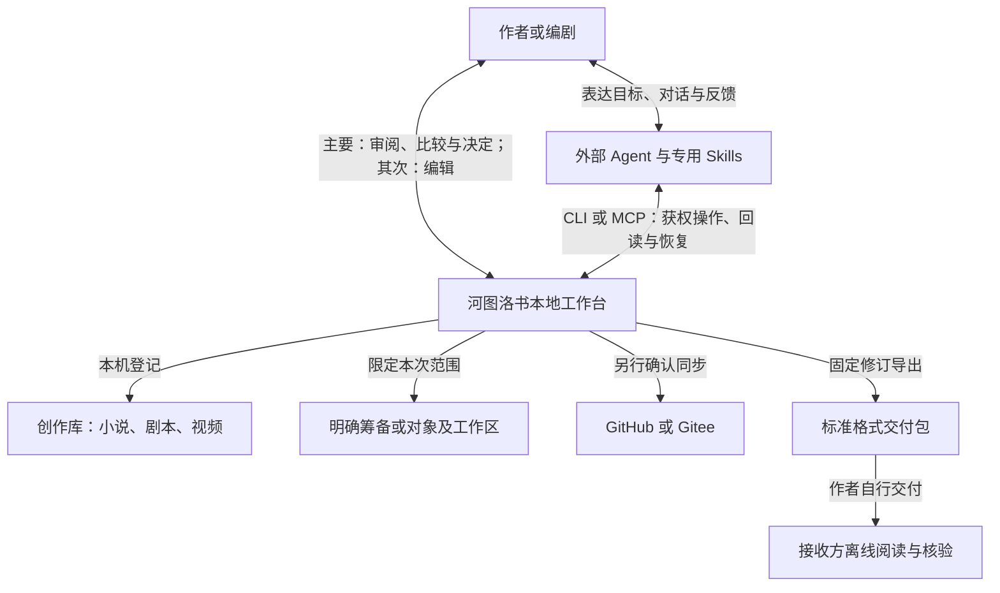
```mermaid
flowchart TB
    author["作者或编剧"] <-->|"主要：审阅、比较与决定；其次：编辑"| hetu["河图洛书本地工作台"]
    author <-->|"表达目标、对话与反馈"| host["外部 Agent 与专用 Skills"]
    host <-->|"CLI 或 MCP：获权操作、回读与恢复"| hetu
    hetu -->|"本机登记"| library["创作库：小说、剧本、视频"]
    hetu -->|"限定本次范围"| content["明确筹备或对象及工作区"]
    hetu -->|"另行确认同步"| remote["GitHub 或 Gitee"]
    hetu -->|"固定修订导出"| bundle["标准格式交付包"]
    bundle -->|"作者自行交付"| recipient["接收方离线阅读与核验"]
```

本图将河图洛书作为一个产品系统，内部模块见第2节，独立进程和通道见第21节。河图洛书不调用外部 Agent 生成、不代用户进行对话。Node.js 页面是按需辅助入口，MCP Apps 是宿主内的交互载体；二者均不替代原生创作软件或保存第二套作品事实。书库登记不合并作品目录，也不自动创建共同 IP。

## 2. 内部组件与依赖

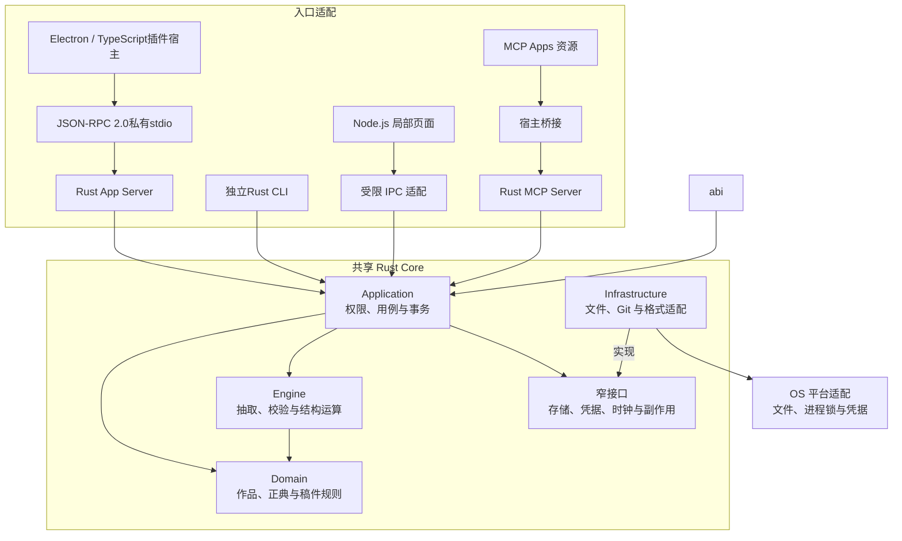
```mermaid
flowchart TD
    subgraph entry["入口适配"]
        desktop["Electron / TypeScript插件宿主"] --> rpc["JSON-RPC 2.0私有stdio"]
        rpc --> server["Rust App Server"]
        cli["独立Rust CLI"]
        mcp["Rust MCP Server"]
        web["Node.js 局部页面"] --> ipc["受限 IPC 适配"]
        appUi["MCP Apps 资源"] --> hostBridge["宿主桥接"]
        hostBridge --> mcp
    end
    subgraph kernel["共享 Rust Core"]
        application["Application<br/>权限、用例与事务"]
        domain["Domain<br/>作品、正典与稿件规则"]
        engine["Engine<br/>抽取、校验与结构运算"]
        ports["窄接口<br/>存储、凭据、时钟与副作用"]
        infrastructure["Infrastructure<br/>文件、Git 与格式适配"]
        application --> domain
        application --> engine
        application --> ports
        engine --> domain
        infrastructure -->|"实现"| ports
    end
    server --> application
    cli --> application
    abi --> application
    mcp --> application
    ipc --> application
    infrastructure --> os["OS 平台适配<br/>文件、进程锁与凭据"]
```

图中表示源码依赖，不表示领域对象直接读写磁盘。应用层在入口组合时获得基础设施实现，领域与规则运算只消费显式输入；只在实际外部边界使用窄接口。Electron/TS插件宿主与Rust Core的分工见39，CLI/MCP独立入口见03，运行进程与通道见第21节。

## 3. 首次使用与客户端接入流程

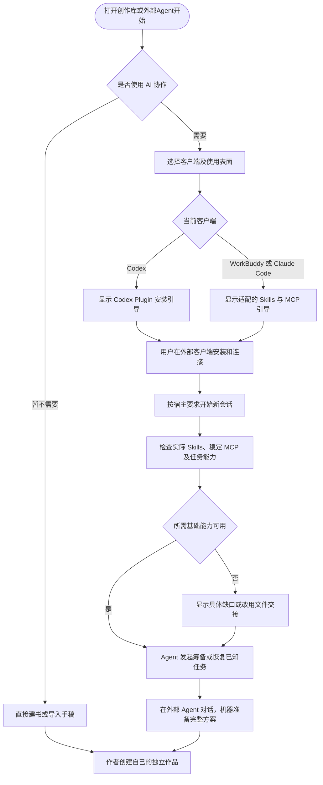
```mermaid
flowchart TD
    start(["打开创作库或外部Agent开始"]) --> mode{"是否使用 AI 协作"}
    mode -->|"暂不需要"| manual["直接建书或导入手稿"]
    mode -->|"需要"| choose["选择客户端及使用表面"]
    choose --> type{"当前客户端"}
    type -->|"Codex"| plugin["显示 Codex Plugin 安装引导"]
    type -->|"WorkBuddy 或 Claude Code"| skills["显示适配的 Skills 与 MCP 引导"]
    plugin --> install["用户在外部客户端安装和连接"]
    skills --> install
    install --> newSession["按宿主要求开始新会话"]
    newSession --> check["检查实际 Skills、稳定 MCP 及任务能力"]
    check --> usable{"所需基础能力可用"}
    usable -->|"是"| task["Agent 发起筹备或恢复已知任务"]
    usable -->|"否"| resolve["显示具体缺口或改用文件交接"]
    resolve --> task
    manual --> book["作者创建自己的独立作品"]
    task --> concept["在外部 Agent 对话，机器准备完整方案"]
    concept --> book
```

客户端安装、用户确认完成和实际连接检查分别记录。选择某品牌不自动证明 Apps、浏览器、图像或本机文件能力可用。

## 4. 建书与封面业务流程

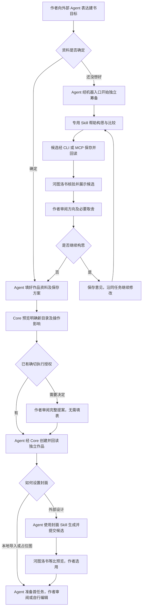
```mermaid
flowchart TD
    newBook["作者向外部 Agent 表达建书目标"] --> known{"资料是否确定"}
    known -->|"确定"| form["Agent 填好作品资料及保存方案"]
    known -->|"还没想好"| idea["Agent 经机器入口开始独立筹备"]
    idea --> external["专用 Skill 帮助构思与比较"]
    external --> result["候选经 CLI 或 MCP 保存并回读"]
    result --> verify["河图洛书核验并展示候选"]
    verify --> choose["作者审阅方向及必要取舍"]
    choose --> satisfied{"是否继续构思"}
    satisfied -->|"是"| feedback["保存意见，沿同任务继续修改"]
    feedback --> external
    satisfied -->|"否"| form
    form --> previewCreate["Core 预览明确新目录及操作影响"]
    previewCreate --> decide{"已有确切执行授权"}
    decide -->|"有"| create["Agent 经 Core 创建并回读独立作品"]
    decide -->|"需要决定"| approval["作者审阅完整提案，无需填表"]
    approval --> create
    create --> cover{"如何设置封面"}
    cover -->|"本地导入或占位图"| write["Agent 准备首任务，作者审阅或自行编辑"]
    cover -->|"外部设计"| coverAgent["Agent 使用封面 Skill 生成并提交候选"]
    coverAgent --> preview["河图洛书等比预览，作者选用"]
    preview --> write
```

筹备阶段可以探索封面；进入正式作品前不写 BookCover。创建失败保留筹备，重复原请求只返回同一本书，不能因网络或窗口重开复制创建。

## 5. 接入时序

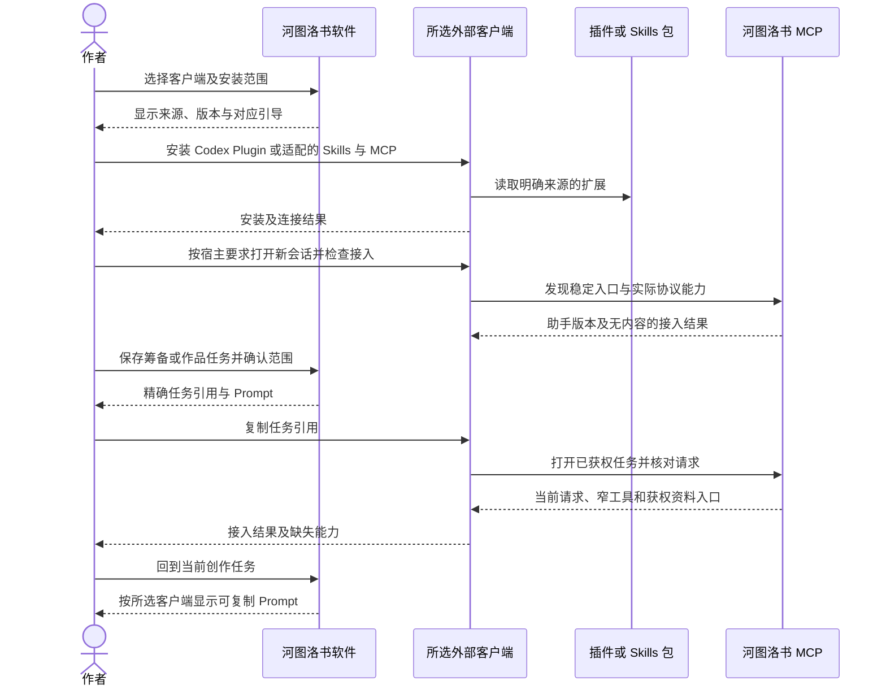
```mermaid
sequenceDiagram
    actor author as 作者
    participant desktop as 河图洛书软件
    participant host as 所选外部客户端
    participant package as 插件或 Skills 包
    participant server as 河图洛书 MCP
    author->>desktop: 选择客户端及安装范围
    desktop-->>author: 显示来源、版本与对应引导
    author->>host: 安装 Codex Plugin 或适配的 Skills 与 MCP
    host->>package: 读取明确来源的扩展
    host-->>author: 安装及连接结果
    author->>host: 按宿主要求打开新会话并检查接入
    host->>server: 发现稳定入口与实际协议能力
    server-->>host: 助手版本及无内容的接入结果
    author->>desktop: 保存筹备或作品任务并确认范围
    desktop-->>author: 精确任务引用与 Prompt
    author->>host: 复制任务引用
    host->>server: 打开已获权任务并核对请求
    server-->>host: 当前请求、窄工具和获权资料入口
    host-->>author: 接入结果及缺失能力
    author->>desktop: 回到当前创作任务
    desktop-->>author: 按所选客户端显示可复制 Prompt
```

MCP `2026-07-28` 采用 `server/discover` 与每请求元数据，legacy 宿主使用独立适配；图中不将两套握手混为同一协议。河图洛书不自动安装用户的 Agent 或启动生成对话。

## 6. 建书构思与候选回传时序

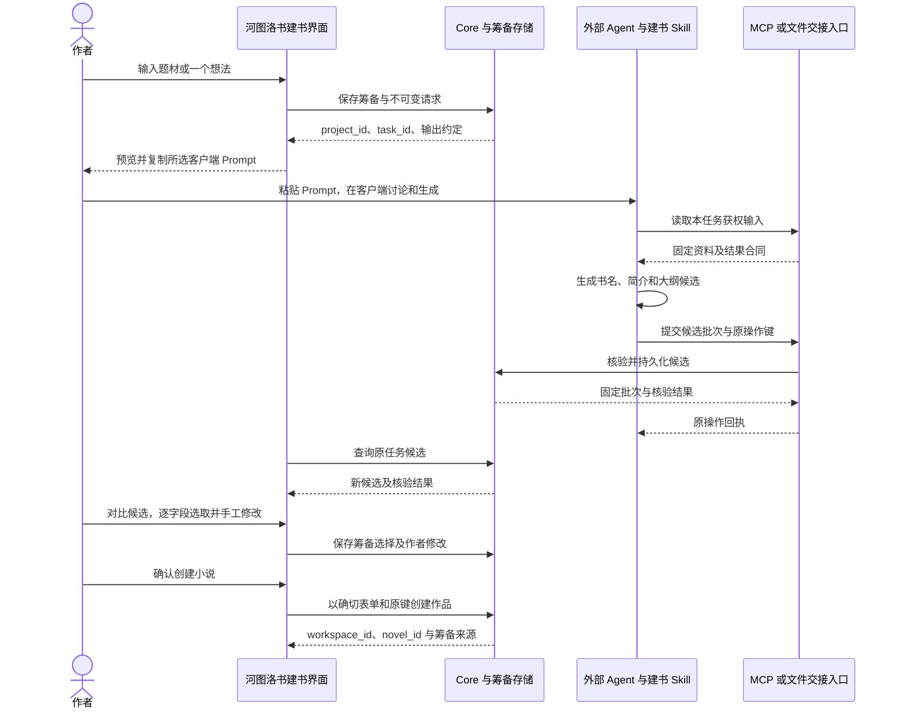
```mermaid
sequenceDiagram
    actor author as 作者
    participant desktop as 河图洛书建书界面
    participant core as Core 与筹备存储
    participant host as 外部 Agent 与建书 Skill
    participant server as MCP 或文件交接入口
    author->>desktop: 输入题材或一个想法
    desktop->>core: 保存筹备与不可变请求
    core-->>desktop: project_id、task_id、输出约定
    desktop-->>author: 预览并复制所选客户端 Prompt
    author->>host: 粘贴 Prompt，在客户端讨论和生成
    host->>server: 读取本任务获权输入
    server-->>host: 固定资料及结果合同
    host->>host: 生成书名、简介和大纲候选
    host->>server: 提交候选批次与原操作键
    server->>core: 核验并持久化候选
    core-->>server: 固定批次与核验结果
    server-->>host: 原操作回执
    desktop->>core: 查询原任务候选
    core-->>desktop: 新候选及核验结果
    author->>desktop: 对比候选，逐字段选取并手工修改
    desktop->>core: 保存筹备选择及作者修改
    author->>desktop: 确认创建小说
    desktop->>core: 以确切表单和原键创建作品
    core-->>desktop: workspace_id、novel_id 与筹备来源
```

没有 workspace 时只允许筹备 scope；Agent 不因此获得书库位置或其他小说。复制、生成、候选保存和创建作品分别有结果。

## 7. 已有作品的参考稿协作时序

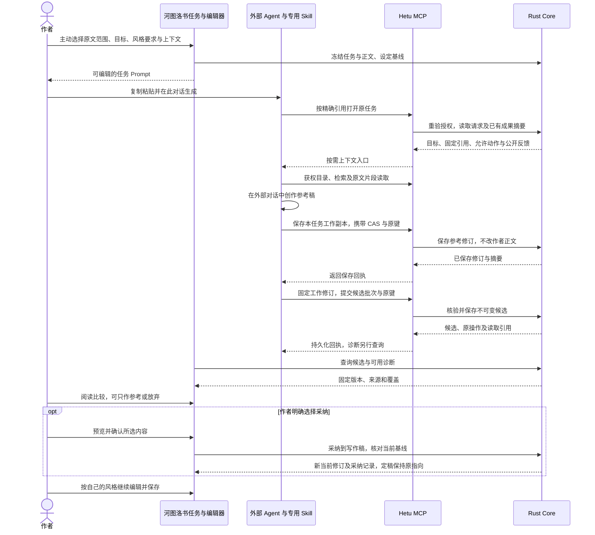
```mermaid
sequenceDiagram
    actor author as 作者
    participant desktop as 河图洛书任务与编辑器
    participant host as 外部 Agent 与专用 Skill
    participant server as Hetu MCP
    participant core as Rust Core
    author->>desktop: 主动选择原文范围、目标、风格要求与上下文
    desktop->>core: 冻结任务与正文、设定基线
    desktop-->>author: 可编辑的任务 Prompt
    author->>host: 复制粘贴并在此对话生成
    host->>server: 按精确引用打开原任务
    server->>core: 重验授权，读取请求及已有成果摘要
    core-->>server: 目标、固定引用、允许动作与公开反馈
    server-->>host: 按需上下文入口
    host->>server: 获权目录、检索及原文片段读取
    host->>host: 在外部对话中创作参考稿
    host->>server: 保存本任务工作副本，携带 CAS 与原键
    server->>core: 保存参考修订，不改作者正文
    core-->>server: 已保存修订与摘要
    server-->>host: 返回保存回执
    host->>server: 固定工作修订，提交候选批次与原键
    server->>core: 核验并保存不可变候选
    core-->>server: 候选、原操作及读取引用
    server-->>host: 持久化回执，诊断另行查询
    desktop->>core: 查询候选与可用诊断
    core-->>desktop: 固定版本、来源和覆盖
    author->>desktop: 阅读比较，可只作参考或放弃
    opt 作者明确选择采纳
        author->>desktop: 预览并确认所选内容
        desktop->>core: 采纳到写作稿，核对当前基线
        core-->>desktop: 新当前修订及采纳记录，定稿保持原指向
    end
    author->>desktop: 按自己的风格继续编辑并保存
```

本流程由作者按需进入，不是编辑或定稿的前置。接收候选只更新参考列表，不改作者正文、未保存缓冲或编辑焦点；作者可参照后自行改写，无需采纳。源文变化时进入三方比较，不自动把旧候选覆盖到新正文。要求 Agent 重写时先保存公开反馈，再由作者明确请求继续；有宿主消息能力才桥接，无能力复制继续提示词。Agent 回读原任务、成果和反馈后返工；资源通知不自动运行模型。

## 8. MCP Apps 局部交互时序

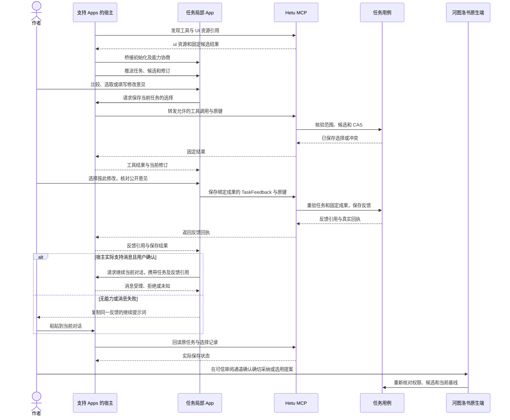
```mermaid
sequenceDiagram
    actor author as 作者
    participant host as 支持 Apps 的宿主
    participant app as 任务局部 App
    participant server as Hetu MCP
    participant core as 任务用例
    participant desktop as 河图洛书原生端
    host->>server: 发现工具与 UI 资源引用
    server-->>host: ui 资源和固定候选结果
    host->>app: 桥接初始化及能力协商
    host->>app: 推送任务、候选和修订
    author->>app: 比较、选取或填写修改意见
    app->>host: 请求保存当前任务的选择
    host->>server: 转发允许的工具调用与原键
    server->>core: 核验范围、候选和 CAS
    core-->>server: 已保存选择或冲突
    server-->>host: 固定结果
    host-->>app: 工具结果与当前修订
    author->>app: 选择按此修改，核对公开意见
    app->>server: 保存绑定成果的 TaskFeedback 与原键
    server->>core: 重验任务和固定成果，保存反馈
    core-->>server: 反馈引用与真实回执
    server-->>host: 返回反馈回执
    host-->>app: 反馈引用与保存结果
    alt 宿主实际支持消息且用户确认
        app->>host: 请求继续当前对话，携带任务及反馈引用
        host-->>app: 消息受理、拒绝或未知
    else 无能力或消息失败
        app-->>author: 复制同一反馈的继续提示词
        author->>host: 粘贴到当前对话
    end
    host->>server: 回读原任务与选择记录
    server-->>host: 实际保存状态
    author->>desktop: 在可信审阅通道确认确切采纳或选用提案
    desktop->>core: 重新核对权限、候选和当前基线
```

App 选择不等于正文定稿。Apps 不可用时同一候选在河图洛书显示，不能丢失结果或强制更换客户端。

## 9. 按需本地网页与浏览器时序

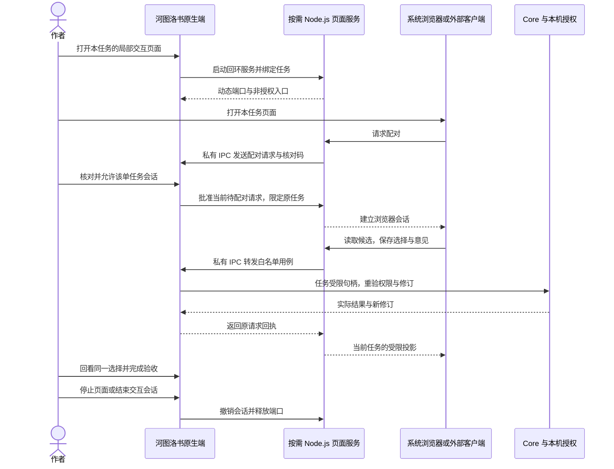
```mermaid
sequenceDiagram
    actor author as 作者
    participant desktop as 河图洛书原生端
    participant node as 按需 Node.js 页面服务
    participant browser as 系统浏览器或外部客户端
    participant core as Core 与本机授权
    author->>desktop: 打开本任务的局部交互页面
    desktop->>node: 启动回环服务并绑定任务
    node-->>desktop: 动态端口与非授权入口
    author->>browser: 打开本任务页面
    browser->>node: 请求配对
    node->>desktop: 私有 IPC 发送配对请求与核对码
    author->>desktop: 核对并允许该单任务会话
    desktop->>node: 批准当前待配对请求，限定原任务
    node-->>browser: 建立浏览器会话
    browser->>node: 读取候选，保存选择与意见
    node->>desktop: 私有 IPC 转发白名单用例
    desktop->>core: 任务受限句柄，重验权限与修订
    core-->>desktop: 实际结果与新修订
    desktop-->>node: 返回原请求回执
    node-->>browser: 当前任务的受限投影
    author->>desktop: 回看同一选择并完成验收
    author->>desktop: 停止页面或结束交互会话
    desktop->>node: 撤销会话并释放端口
```

页面不假设能读取宿主文件或 `window.openai`。浏览器自动化不能代替原生作者批准；云端浏览器不可达本机时回退原生界面，不自动开公网隧道。

## 10. 参考稿审核状态

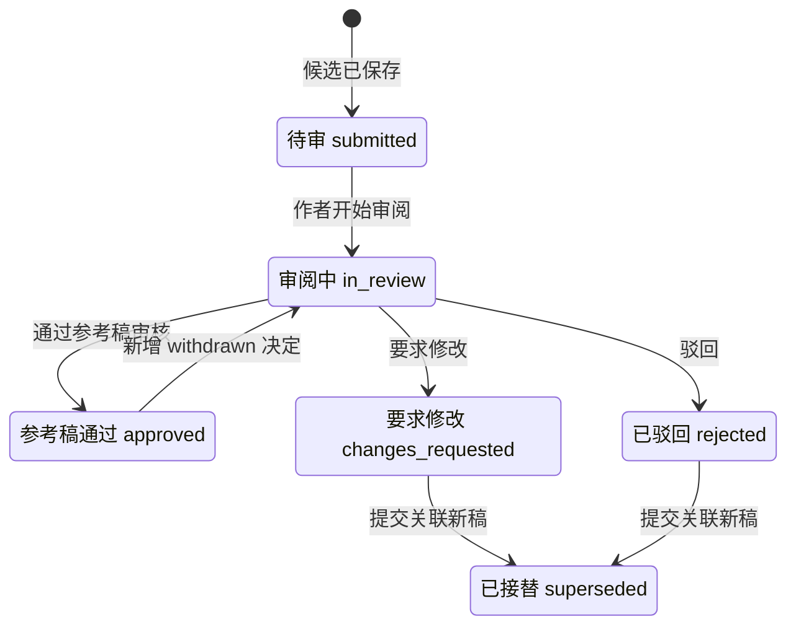
```mermaid
stateDiagram-v2
    state "待审 submitted" as submitted
    state "审阅中 in_review" as inReview
    state "参考稿通过 approved" as approved
    state "要求修改 changes_requested" as changesRequested
    state "已驳回 rejected" as rejected
    state "已接替 superseded" as superseded
    [*] --> submitted: 候选已保存
    submitted --> inReview: 作者开始审阅
    inReview --> approved: 通过参考稿审核
    inReview --> changesRequested: 要求修改
    inReview --> rejected: 驳回
    changesRequested --> superseded: 提交关联新稿
    rejected --> superseded: 提交关联新稿
    approved --> inReview: 新增 withdrawn 决定
```

`inReview` 等图名映射 Draft 的 snake_case 状态。`withdrawn` 是审核决定，撤回后状态为 `in_review`，不是 `submitted`，也不是新增的 Draft 状态。所有状态均保留原候选与决定；撤回审核不撤销已发生的采纳。`approved` 不等于定稿，作者采纳另写 AdoptionRecord；审核上下文是否过期是计算状态，不新增持久枚举。返工时旧稿变为 `superseded`，新 draft ID 从 `submitted` 开始，不能在原记录上替换正文。

## 11. 写作、采纳与独立定稿流程

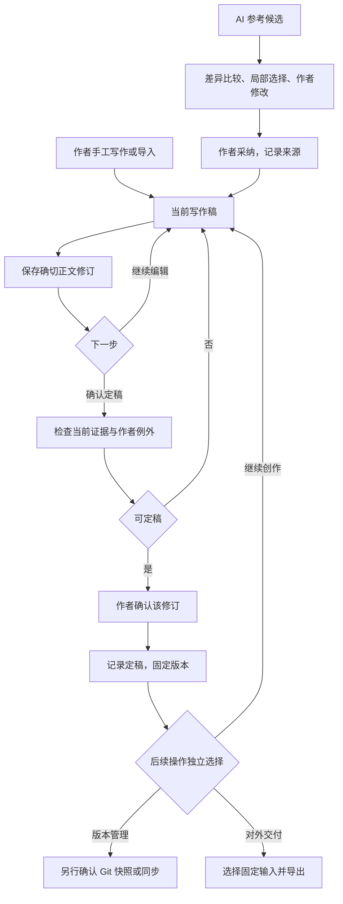
```mermaid
flowchart TD
    manual["作者手工写作或导入"] --> writing["当前写作稿"]
    candidate["AI 参考候选"] --> compare["差异比较、局部选择、作者修改"]
    compare --> adopt["作者采纳，记录来源"]
    adopt --> writing
    writing --> save["保存确切正文修订"]
    save --> edit{"下一步"}
    edit -->|"继续编辑"| writing
    edit -->|"确认定稿"| check["检查当前证据与作者例外"]
    check --> valid{"可定稿"}
    valid -->|"否"| writing
    valid -->|"是"| confirm["作者确认该修订"]
    confirm --> final["记录定稿，固定版本"]
    final --> next{"后续操作独立选择"}
    next -->|"继续创作"| writing
    next -->|"版本管理"| git["另行确认 Git 快照或同步"]
    next -->|"对外交付"| export["选择固定输入并导出"]
```

编辑新稿不会抹除旧定稿，采纳参考稿不会更新定稿指针，软件不自动向投稿平台发稿。

## 12. 定稿与撤回时序

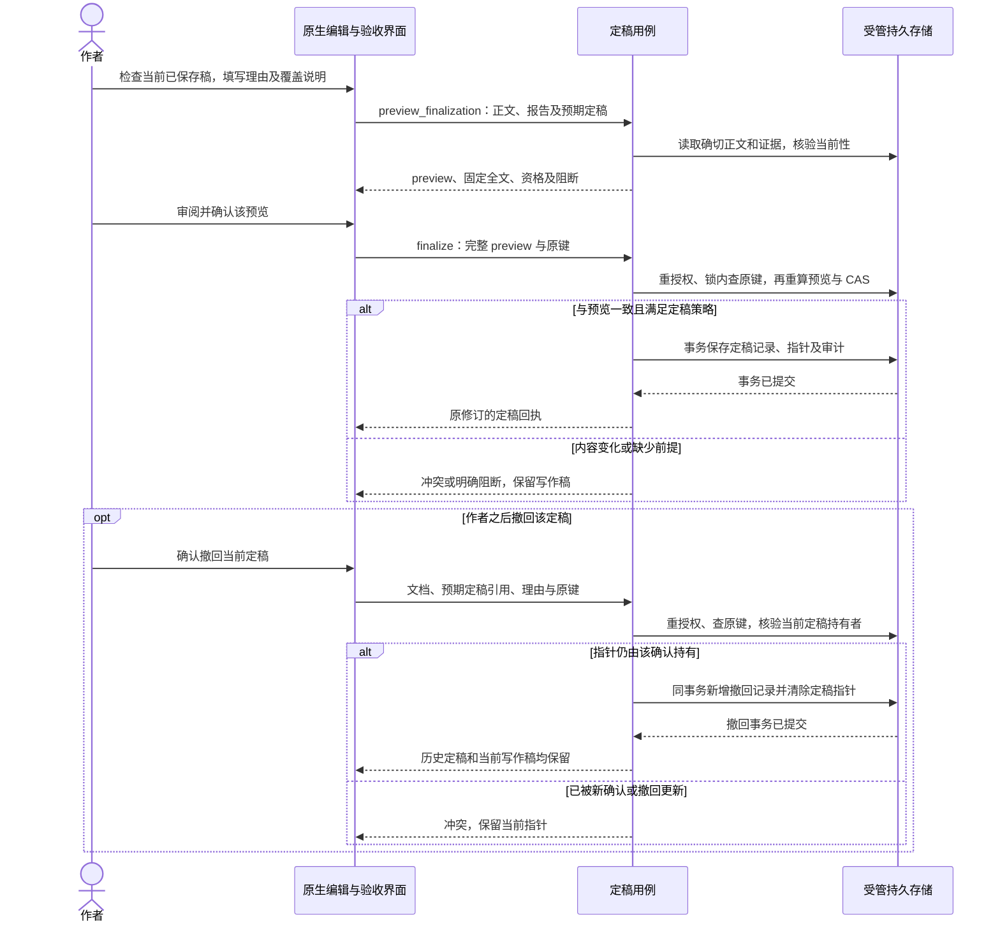
```mermaid
sequenceDiagram
    actor author as 作者
    participant editor as 原生编辑与验收界面
    participant core as 定稿用例
    participant storage as 受管持久存储
    author->>editor: 检查当前已保存稿，填写理由及覆盖说明
    editor->>core: preview_finalization：正文、报告及预期定稿
    core->>storage: 读取确切正文和证据，核验当前性
    core-->>editor: preview、固定全文、资格及阻断
    author->>editor: 审阅并确认该预览
    editor->>core: finalize：完整 preview 与原键
    core->>storage: 重授权、锁内查原键，再重算预览与 CAS
    alt 与预览一致且满足定稿策略
        core->>storage: 事务保存定稿记录、指针及审计
        storage-->>core: 事务已提交
        core-->>editor: 原修订的定稿回执
    else 内容变化或缺少前提
        core-->>editor: 冲突或明确阻断，保留写作稿
    end
    opt 作者之后撤回该定稿
        author->>editor: 确认撤回当前定稿
        editor->>core: 文档、预期定稿引用、理由与原键
        core->>storage: 重授权、查原键，核验当前定稿持有者
        alt 指针仍由该确认持有
            core->>storage: 同事务新增撤回记录并清除定稿指针
            storage-->>core: 撤回事务已提交
            core-->>editor: 历史定稿和当前写作稿均保留
        else 已被新确认或撤回更新
            core-->>editor: 冲突，保留当前指针
        end
    end
```

## 13. 原操作与断线恢复

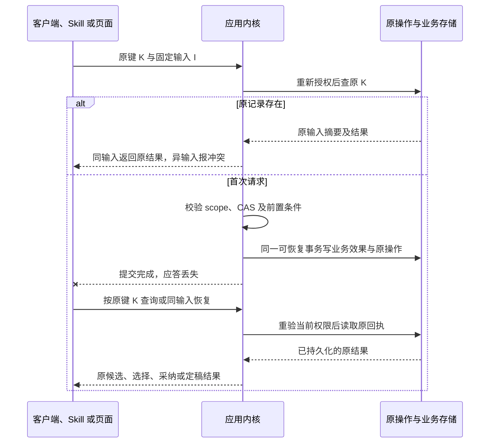
```mermaid
sequenceDiagram
    participant client as 客户端、Skill 或页面
    participant core as 应用内核
    participant disk as 原操作与业务存储
    client->>core: 原键 K 与固定输入 I
    core->>disk: 重新授权后查原 K
    alt 原记录存在
        disk-->>core: 原输入摘要及结果
        core-->>client: 同输入返回原结果，异输入报冲突
    else 首次请求
        core->>core: 校验 scope、CAS 及前置条件
        core->>disk: 同一可恢复事务写业务效果与原操作
        core--xclient: 提交完成，应答丢失
        client->>core: 按原键 K 查询或同输入恢复
        core->>disk: 重验当前权限后读取原回执
        disk-->>core: 已持久化的原结果
        core-->>client: 原候选、选择、采纳或定稿结果
    end
```

关闭 Apps、网页或软件只影响观察；不自动取消外部生成、退款或换键重试。外部生成结果未知时先核对原任务和已有文件。

## 14. 标准格式交付流程

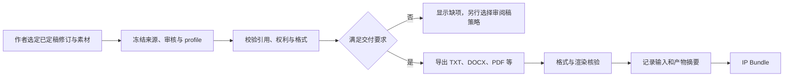
```mermaid
flowchart LR
    select["作者选定已定稿修订与素材"] --> freeze["冻结来源、审核与 profile"]
    freeze --> check["校验引用、权利与格式"]
    check --> valid{"满足交付要求"}
    valid -->|"否"| gaps["显示缺项，另行选择审阅稿策略"]
    valid -->|"是"| render["导出 TXT、DOCX、PDF 等"]
    render --> inspect["格式与渲染核验"]
    inspect --> manifest["记录输入和产物摘要"]
    manifest --> bundle["IP Bundle"]
```

默认不混入 AI 参考稿、私密批注和未定稿内容；作者显式导出审阅材料时清楚标识。导出不是自动发稿、上传或发送给制片方。

## 15. Git 同步与冲突流程

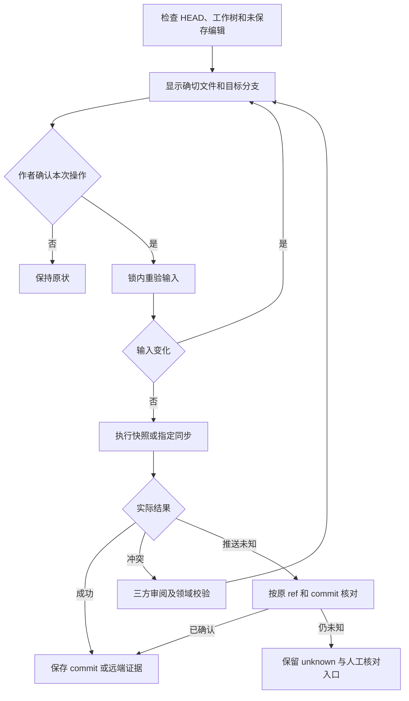
```mermaid
flowchart TD
    status["检查 HEAD、工作树和未保存编辑"] --> preview["显示确切文件和目标分支"]
    preview --> confirm{"作者确认本次操作"}
    confirm -->|"否"| stop["保持原状"]
    confirm -->|"是"| recheck["锁内重验输入"]
    recheck --> changed{"输入变化"}
    changed -->|"是"| preview
    changed -->|"否"| execute["执行快照或指定同步"]
    execute --> result{"实际结果"}
    result -->|"成功"| receipt["保存 commit 或远端证据"]
    result -->|"冲突"| resolve["三方审阅及领域校验"]
    resolve --> preview
    result -->|"推送未知"| query["按原 ref 和 commit 核对"]
    query -->|"已确认"| receipt
    query -->|"仍未知"| unknown["保留 unknown 与人工核对入口"]
```

## 16. 创作库与多作品切换

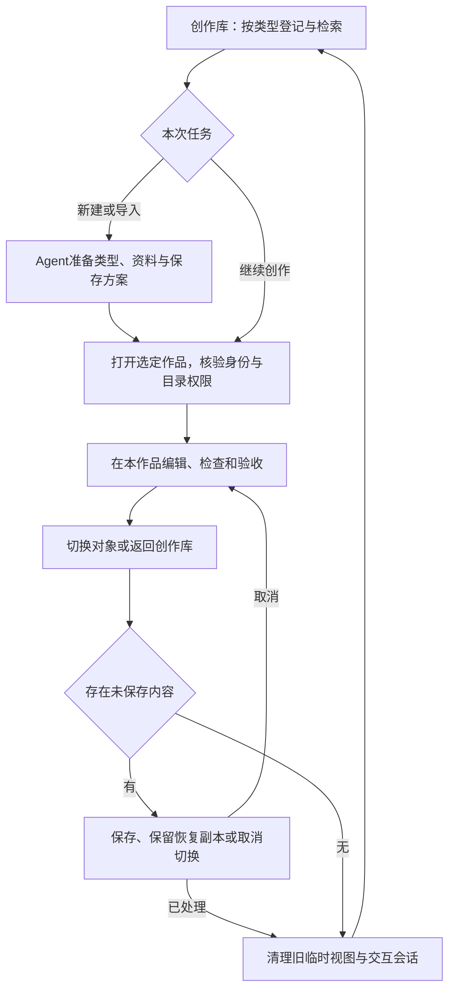
```mermaid
flowchart TD
    library["创作库：按类型登记与检索"] --> choose{"本次任务"}
    choose -->|"新建或导入"| create["Agent准备类型、资料与保存方案"]
    create --> open["打开选定作品，核验身份与目录权限"]
    choose -->|"继续创作"| open
    open --> work["在本作品编辑、检查和验收"]
    work --> switch["切换对象或返回创作库"]
    switch --> buffer{"存在未保存内容"}
    buffer -->|"有"| resolve["保存、保留恢复副本或取消切换"]
    resolve -->|"取消"| work
    resolve -->|"已处理"| clear["清理旧临时视图与交互会话"]
    buffer -->|"无"| clear
    clear --> library
```

创作库仅持有本机登记与可重建摘要，不合并作品正文或设定。打开另一部作品须独立核验权限；旧 Agent 会话不自动获得新作品范围，旧任务和候选仍留在原作品。

## 17. 分卷与章节管理

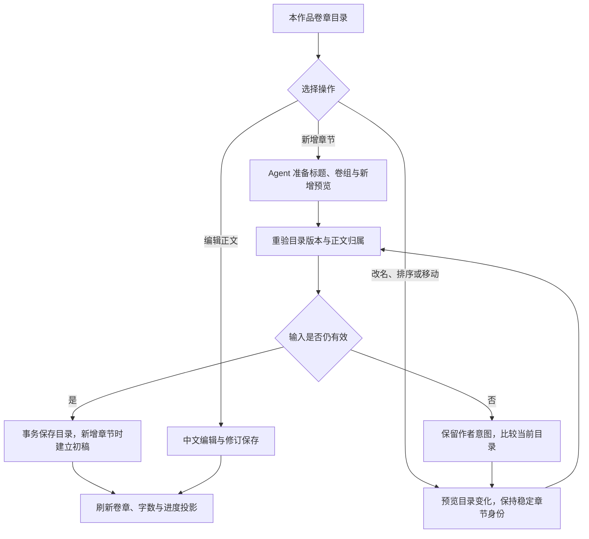
```mermaid
flowchart TD
    tree["本作品卷章目录"] --> action{"选择操作"}
    action -->|"新增章节"| new["Agent 准备标题、卷组与新增预览"]
    new --> cas
    action -->|"改名、排序或移动"| preview["预览目录变化，保持稳定章节身份"]
    preview --> cas["重验目录版本与正文归属"]
    cas --> result{"输入是否仍有效"}
    save["事务保存目录，新增章节时建立初稿"]
    result -->|"是"| save
    result -->|"否"| reload["保留作者意图，比较当前目录"]
    reload --> preview
    action -->|"编辑正文"| edit["中文编辑与修订保存"]
    save --> view["刷新卷章、字数与进度投影"]
    edit --> view
```

章节改名、重排和跨卷移动不改变 document ID，不把显示序号写成引用身份，不创建正文修订或删除既有正文／定稿。新增章节与目录登记须同一可恢复事务完成，不能出现目录有章但正文缺失。

## 18. 短剧项目与剧本管理

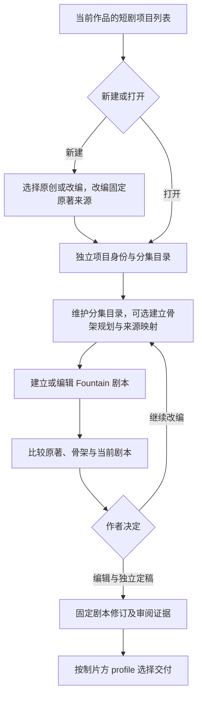
```mermaid
flowchart TD
    projects["当前作品的短剧项目列表"] --> select{"新建或打开"}
    select -->|"新建"| source["选择原创或改编，改编固定原著来源"]
    source --> project["独立项目身份与分集目录"]
    select -->|"打开"| project
    project --> structure["维护分集目录，可选建立骨架规划与来源映射"]
    structure --> script["建立或编辑 Fountain 剧本"]
    script --> compare["比较原著、骨架与当前剧本"]
    compare --> next{"作者决定"}
    next -->|"继续改编"| structure
    next -->|"编辑与独立定稿"| final["固定剧本修订及审阅证据"]
    final --> export["按制片方 profile 选择交付"]
```

同一小说的不同改编项目各自保存分集、场次及剧本引用；重建结构产生候选，不覆盖已有人工编排。书库作品、短剧项目、剧本文档和分集编号是不同层级，不能用项目名称或集号互相替代。

## 19. 小说到短剧的结构化时序

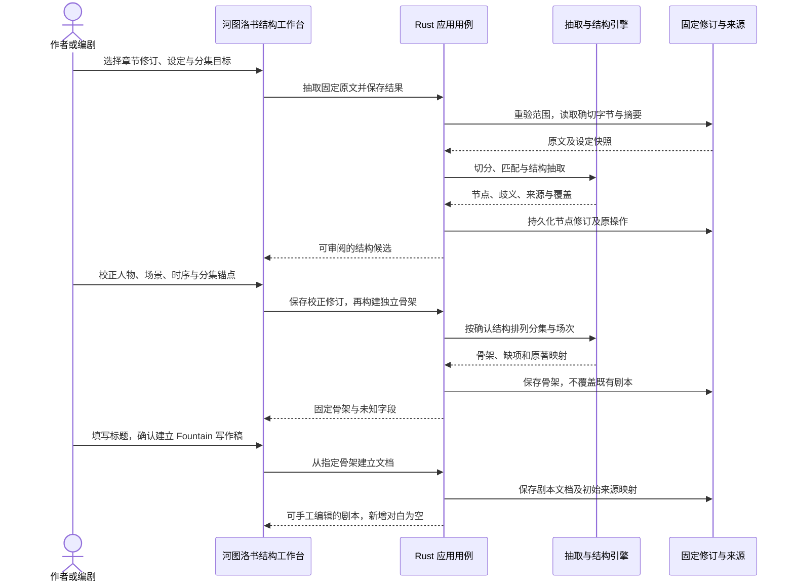
```mermaid
sequenceDiagram
    actor author as 作者或编剧
    participant desktop as 河图洛书结构工作台
    participant core as Rust 应用用例
    participant engine as 抽取与结构引擎
    participant storage as 固定修订与来源
    author->>desktop: 选择章节修订、设定与分集目标
    desktop->>core: 抽取固定原文并保存结果
    core->>storage: 重验范围，读取确切字节与摘要
    storage-->>core: 原文及设定快照
    core->>engine: 切分、匹配与结构抽取
    engine-->>core: 节点、歧义、来源与覆盖
    core->>storage: 持久化节点修订及原操作
    core-->>desktop: 可审阅的结构候选
    author->>desktop: 校正人物、场景、时序与分集锚点
    desktop->>core: 保存校正修订，再构建独立骨架
    core->>engine: 按确认结构排列分集与场次
    engine-->>core: 骨架、缺项和原著映射
    core->>storage: 保存骨架，不覆盖既有剧本
    core-->>desktop: 固定骨架与未知字段
    author->>desktop: 填写标题，确认建立 Fountain 写作稿
    desktop->>core: 从指定骨架建立文档
    core->>storage: 保存剧本文档及初始来源映射
    core-->>desktop: 可手工编辑的剧本，新增对白为空
```

抽取整理已有内容，不补因果、对白或镜头。外部 Agent 辅助填稿沿第7节参考稿路径交接；原著变化后映射显示过期，作者决定是否重新比较与更新。

## 20. 诊断、证据定位与作者处置

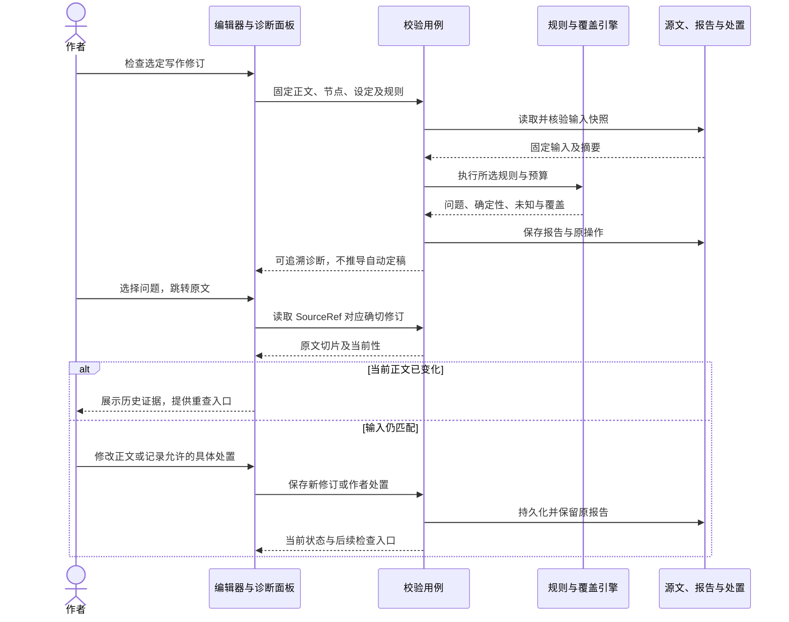
```mermaid
sequenceDiagram
    actor author as 作者
    participant desktop as 编辑器与诊断面板
    participant core as 校验用例
    participant engine as 规则与覆盖引擎
    participant storage as 源文、报告与处置
    author->>desktop: 检查选定写作修订
    desktop->>core: 固定正文、节点、设定及规则
    core->>storage: 读取并核验输入快照
    storage-->>core: 固定输入及摘要
    core->>engine: 执行所选规则与预算
    engine-->>core: 问题、确定性、未知与覆盖
    core->>storage: 保存报告与原操作
    core-->>desktop: 可追溯诊断，不推导自动定稿
    author->>desktop: 选择问题，跳转原文
    desktop->>core: 读取 SourceRef 对应确切修订
    core-->>desktop: 原文切片及当前性
    alt 当前正文已变化
        desktop-->>author: 展示历史证据，提供重查入口
    else 输入仍匹配
        author->>desktop: 修改正文或记录允许的具体处置
        desktop->>core: 保存新修订或作者处置
        core->>storage: 持久化并保留原报告
        core-->>desktop: 当前状态与后续检查入口
    end
```

诊断完整性、规则结论与作者决定分别显示。源文定位不把历史字节范围直接套到新稿；业务例外不修改机器结论，数据损坏与无效引用不能豁免。

## 21. 运行部署与信任边界

```mermaid
flowchart TB
    host["外部宿主：Agent、Skills 与隔离的 Apps"]
    browser["可达本机的浏览器或 WebView"]
    subgraph nativeProcess["Electron主进程与TS插件宿主"]
        nativeUi["可信React工作台"] -->|"受限preload"| main["主进程"]
        main -->|"JSON-RPC 2.0私有stdio"| nativeCore["独立Rust App Server / Core"]
        restrictedIpc["单任务及插件范围代理"] --> nativeCore
    end
    subgraph cliProcess["独立 CLI 进程"]
        cliEntry["Rust薄入口"] --> cliCore["进程内Rust Core"]
        cliEntry -.-> pluginHost["按需Node / TypeScript插件宿主"]
    end
    subgraph mcpProcess["独立 MCP 进程"]
        mcpEntry["Rust stdio 适配"] --> mcpCore["进程内 Rust Core"]
    end
    nativeUi -.->|"按需启停和作者配对"| node["Node.js 页面进程"]
    browser -->|"已配对回环 HTTP"| node
    node -->|"受限 IPC"| restrictedIpc
    host -->|"stdio 与受限工具"| mcpEntry
    nativeCore --> data["受管目录：单筹备或单作品"]
    cliCore --> data
    mcpCore --> data
    nativeUi --> localData["本机书库、偏好与作者批准"]
```

三个 Core 框表示同一业务实现链接进不同入口进程，不是三个业务服务或三份数据库。每个 Core 均执行授权、范围锁、CAS 和恢复协议，受管读取不会跳过这些检查；同目录的并发由 OS 锁和版本核验协调。Node.js 只代理发起它的应用会话内的受限用例，不能转发作者句柄或任意动作。IPC 的具体传输依实现合同确定，不从本图推导固定端口或全局 RPC 服务。

CLI 与 MCP 可在桌面退出后独立执行已获权用例；局部页面随发起它的应用会话结束而撤销。读原回执仍重新授权，Apps 或网页的点击不能变成作者管理权限。Git 远端属于第1节的外部系统，凭据经平台适配使用，不进入内容目录、MCP 或网页。外部 Agent 若另有直接磁盘权限，仍可能绕过受管 API；摘要和读取校验用于发现改写，不宣称 OS 沙箱隔离。

## 22. 中文编辑、保存与并发冲突时序

```mermaid
sequenceDiagram
    actor author as 作者
    participant editor as 中文Web编辑器
    participant recovery as 本机缓冲恢复
    participant core as 保存用例
    participant store as 工作区事务存储
    author->>editor: 中文输入、撤销或粘贴
    editor->>recovery: 保存可恢复缓冲及所基于修订
    author->>editor: 保存当前稿
    alt 存在输入法组合
        editor-->>author: 等待组合结束，保留焦点和选区
    else 组合结束且可提交
        editor->>core: 文档、基线修订、原始内容与原键
        core->>store: 重新授权、锁内查原键并核对 CAS
        alt 基线与当前一致
            core->>store: 同事务保存新修订、清单、原操作和审计
            store-->>core: 已提交的确切修订及摘要
            core-->>editor: 保存成功，定稿指针保持
            editor->>recovery: 关联已确认修订，保留更新中的后续缓冲
        else 其他窗口或进程已保存
            core-->>editor: 冲突及当前修订引用
            editor-->>author: 保留本地缓冲，比较基线、当前与本地稿
            author->>editor: 选择合并内容或放弃本次覆盖
            Note over editor,core: 合并后重新预览并以新基线保存，不静默重试覆盖
        end
    end
```

本机缓冲不等于正文修订，保存修订不等于定稿。UTF-16 选区必须转换成原始 UTF-8 边界，CRLF 不因展示而被静默规范化。写入后回执丢失按第13节查询原键；只有原回执确认的内容才显示为已保存。

## 23. 写作稿与定稿的组合状态

以下是 `current_revision_id`、有效定稿指针及编辑缓冲的界面投影，不新增一个同时管理来源、审核和发稿的持久状态字段。

```mermaid
stateDiagram-v2
    state "写作稿，无定稿" as writingOnly
    state "当前稿已定稿" as currentFinal
    state "新写作稿与旧定稿" as newerWriting
    [*] --> writingOnly: 新建、导入或手工保存
    writingOnly --> currentFinal: 独立定稿
    currentFinal --> newerWriting: 保存新修订
    newerWriting --> currentFinal: 新修订独立定稿
    currentFinal --> writingOnly: 撤回当前定稿
    newerWriting --> writingOnly: 撤回旧定稿
```

| 独立维度 | 显示规则 | 不改变的事实 |
| --- | --- | --- |
| 未保存缓冲 | 在上述任一状态叠加“未保存／保存失败／冲突” | 定稿仍指向已确认修订，不包含缓冲 |
| 诊断或设定已变化 | 显示证据过期及重新检查入口 | 历史定稿和原报告保留，不能自动撤回作者决定 |
| AI 来源 | 按实际候选、采纳及修订关联显示 | 手工改写不抹除历史，也不由风格推断 AI 比例 |
| 已导出 | 显示 Bundle 固定输入及导出时间 | 不代表已发布，也不会随新修订自动更新包 |

采纳参考内容也属于保存新修订：无定稿时仍是“写作稿，无定稿”，已有定稿时成为“新写作稿与旧定稿”；在该状态继续保存不会改变旧定稿。撤回动作只针对仍持有当前指针的记录。

## 24. 依赖变化与证据当前性

```mermaid
flowchart TD
    change["收到受管变更或发现外部改写"] --> integrity{"历史文件与摘要完整"}
    integrity -->|"否"| block["完整性阻断：保留证据并进入诊断"]
    integrity -->|"是"| deps["比较固定输入与当前依赖"]
    deps --> content["正文或设定修订变化"]
    deps --> structure["节点、骨架或规则版本变化"]
    deps --> presentation["语言、显示排版或目录顺序变化"]
    content --> stale["相关报告、源映射或定稿资格过期"]
    structure --> stale
    presentation --> affected["仅刷新实际依赖的排序、模板或界面投影"]
    stale --> history["保留历史修订、证据与作者决定"]
    history --> action["作者选择重查、重新映射或独立确认"]
    action --> preview["冻结新输入，生成新报告或变更预览"]
    preview --> confirm["通过 CAS 保存新结果，不迁移旧批准"]
```

| 变化 | 受影响对象 | 作者下一步 |
| --- | --- | --- |
| 当前正文保存新修订 | 绑定旧正文的报告、候选目标基线及当前映射 | 查看旧证据；按新稿重查或重新比较候选 |
| 设定／规则改变 | 消费该设定或规则快照的诊断及定稿资格 | 重查受影响范围，必要时记录新的确认 |
| 骨架调整 | 消费旧骨架的剧本结构映射及候选 | 查看原骨架，明确接受差异或建立新稿 |
| 卷章重排 | 依赖所选章节顺序的全书提取、分集与导出计划 | 重新预览顺序；原 SourceRef 仍指向原字节 |
| 仅改界面语言或阅读样式 | 界面文案和显示布局 | 刷新呈现，不改正文、来源或定稿 |
| 素材权利声明撤回 | 后续交付的素材嵌入资格 | 默认排除，已导出包保留原 manifest，另行沟通接收方 |

是否过期取决于对象实际保存的输入快照，不能仅因收到一次文件事件就把整部小说全部作废。历史不可变内容损坏属于完整性错误，不能用“重新检查”或作者例外掩盖。

## 25. 素材、线索与交付流程

```mermaid
flowchart TD
    need["作者整理视觉或配乐需求"] --> type{"材料来源"}
    type -->|"先写说明"| cue["建立线索，关联固定正文或场次"]
    type -->|"已有本地文件"| inspect["作者选择文件，检查类型、摘要与限制"]
    type -->|"需要外部生成"| prompt["准备专用 Skill Prompt，在外部 Agent 生成"]
    prompt --> candidate["固定 inbox 收到候选及回执"]
    candidate --> verify["核验任务、摘要、格式和范围"]
    verify --> register["从任务 inbox 登记候选文件组"]
    register --> selectAsset["作者比较并选用具体版本"]
    selectAsset --> link
    inspect --> importAsset["导入受管素材，记录来源与权利声明"]
    importAsset --> link["作者把素材与线索关联"]
    cue --> link
    link --> preview["查看等比预览、来源和固定叙事引用"]
    preview --> delivery{"纳入哪种交付"}
    delivery -->|"仅线索说明"| metadata["导出说明及允许公开的来源"]
    delivery -->|"嵌入媒体"| rights{"当前权利允许且媒体完整"}
    rights -->|"是"| embed["冻结素材及声明修订，列入 manifest"]
    rights -->|"否"| exclude["明确排除并显示原因"]
```

没有媒体文件也能维护线索；素材导入不等于选为正式封面。外部生成仅在宿主进行，版权与来源是作者声明。媒体预览、签名识别、完整解码及权利核对分别验收，不以任一项代替其余项。

## 26. 局部采纳时序

```mermaid
sequenceDiagram
    actor author as 作者
    participant desktop as 原生比较与编辑器
    participant core as 采纳用例
    participant store as 作品事务存储
    author->>desktop: 选择参考稿及部分段落
    desktop->>core: 请求候选、基线与当前稿的采纳预览
    core->>store: 读取并核验固定候选、正文和摘要
    store-->>core: 当前事实及原文
    core-->>desktop: 三方差异、来源与预览摘要
    author->>desktop: 确认目标、选区及作者修改
    desktop->>core: 固定预览、预期目标、选区和原键
    core->>store: 锁内重新授权，先查原键再验 CAS
    alt 候选和目标仍与预览一致
        core->>store: 同事务写新修订、采纳记录、目录变化和审计
        store-->>core: 已提交的新当前修订，原定稿指针不变
        core-->>desktop: 采纳回执与结果修订
        desktop-->>author: 打开写作稿，允许继续编辑或撤销
    else 目标变化或选区证据不符
        core-->>desktop: 冲突，不写入任何部分采纳结果
        desktop-->>author: 保留选择，重新比较和预览
    end
```

选区按 UTF-8 半开范围及 quote 核验，非重叠范围才可同次应用。新章节还需作者确认标题和卷组，并与章节目录同事务创建。撤销产生后继编辑，不删除历史采纳；当前稿定稿使用第12节的独立操作。

## 27. 停止局部交互与撤销协作范围

```mermaid
flowchart TD
    author["作者结束协作"] --> choice{"要结束的范围"}
    choice -->|"关闭局部面板"| panel["结束显示，保留任务和已保存意见"]
    choice -->|"停止本地页面"| web["撤销该页面会话，停止代理并释放端口"]
    choice -->|"撤销 MCP 访问"| access["撤销授权并按宿主机制断开当前连接"]
    access --> next["后续读取、写入和原结果查询重新核验权限"]
    panel --> saved["正文、候选、历史决定和原操作保留"]
    web --> saved
    next --> saved
    saved --> pending{"有结果未知或在途操作"}
    pending -->|"有"| observe["由仍获权的作者入口查询原键并核对持久事实"]
    pending -->|"无"| stop["结束本次交互"]
    observe --> stop
```

权限变更与写事务按同一范围串行判定；撤销前已提交的结果不回滚，撤销后不可因知道旧 operation key 就越权读取。关闭页面或断开 MCP 不取消供应商生成、不退款、不撤回已导出包，也不删除作品。外部 Agent 另获 OS 文件权限时，作者还需在对应宿主撤销该权限。

## 28. 作者业务全程总览

```mermaid
flowchart TD
    library["创作库或外部 Agent：明确小说、剧本或视频"] --> organize["Agent 经 CLI/MCP 准备资料、结构和任务"]
    organize -->|"作者选择手动编辑"| writing["按自己的风格编辑<br/>保存写作修订"]
    organize -->|"默认 Agent 协作"| handoff["外部 Agent 规划、起草与整理<br/>软件展示成果和待审操作"]
    writing -->|"可选：请求改稿建议"| handoff
    handoff --> receive["独立参考稿，核验与比较<br/>可保留、忽略或放弃"]
    receive -->|"自行改写或选择采纳"| writing
    receive -->|"返工"| handoff
    writing -->|"可选改编"| adaptation["整理节点、骨架及剧本"]
    writing --> check["检查确切修订<br/>作者处理问题与覆盖说明"]
    writing -->|"另行确认"| git["Git 快照与按需远端同步"]
    adaptation --> check
    check -->|"需要修改"| writing
    check -->|"资格满足并明确确认"| final["作者独立定稿"]
    final -->|"继续写作"| writing
    final -->|"另行选择"| bundle["固定版本文稿交付"]
    final -->|"制作视频"| video["独立视频项目：固定来源与资产"]
    organize -->|"直接开始视频"| video
    video --> previs["镜头与按需预演，作者观看反馈"]
    previs --> clips["获权真实生成与原任务恢复"]
    clips --> edit["剪辑、声音、字幕及实际渲染"]
    edit --> review["连续审片、细节核对与局部返工"]
    review -->|"返工"| video
    review -->|"作者确认确切成片"| delivery["成片与完整工程交付"]
```

默认路线由 Agent 处理业务、作者可视化 review 和作出必要决定；作者手动撰写与优化随时可用。图中不规定作者必须先建完设定，也不要求每章都改编短剧。两种创作方式共用同一编辑和定稿合同；书库切换见第16节，参考稿审核与采纳分别见第10／26节。日常保存、Git 快照、定稿和交付各自有独立结果，Git 快照可包含作者明确选定的未定稿修订。

## 29. 小说与剧本导入时序

### 29.1 会话内整书小说导入

这是已有小说原稿的默认 Agent 旅程。作者在当前对话明确指定原稿与导入目标；Agent 核对完整目录和异常，Core 固定可执行范围。桌面用于完成后的阅读核对，无需开启桌面窗口批准分卷或逐批执行。

```mermaid
sequenceDiagram
    actor author as 作者
    participant agent as 外部 Agent 与导入 Skill
    participant api as CLI 或稳定 MCP
    participant core as Rust Core
    participant store as 作品事务存储
    author->>agent: 将指定原稿导入河图，保留原文
    agent->>agent: 保存原稿快照，核对目录、连续范围与摘要
    agent->>api: 发现实际能力，读取确切作品及已有导入成果
    api->>core: register 精确授权、目录基线、计划及真实指令
    core->>store: 固定范围与客户端管理绑定，尚不写正文
    core-->>agent: import_authorization_ref
    loop 固定分卷及下一组有界批次
        agent->>api: prepare 原输入与原操作键
        api->>core: execute 原方案与导入授权引用
        core->>core: 重验权限、期限、CAS、顺序、标题及原字节
        alt 范围与版本一致
            opt 最后一批
                core->>core: 提交前复核整书阅读摘要
            end
            core->>store: 同事务提交正文、来源、方案结果与授权游标
            core-->>agent: 原方案结果及新目录基线
            agent->>api: 回读每篇修订及导入来源
        else 撤权、过期、目录变化或内容不符
            core-->>agent: 停止，保留原方案与已有成果
        end
    end
    Note over agent,core: 结果未知先查询原回执，不换键重导
    agent-->>author: 已核验目录与篇目、来源和异常
```

`authorization_note` 由 Agent 如实记录实际用户指令，Core 核验确定性范围，不鉴别自然语言说话者或授予作者身份。范围不清时在当前会话澄清；不能借原稿导入进行改稿、采纳、定稿、付费或外部操作。状态与事务字段见[29的导入授权数据](29-数据字典与Schema设计.md#25-会话导入授权数据)，动作及预算见[30的导入授权合同](30-应用API详细设计.md#会话内整书导入授权合同)。

### 29.2 可选人工导入

作者自行选择文件、校正结构时沿用以下旅程；它不构成 Agent 整书导入的前置步骤。

```mermaid
sequenceDiagram
    actor author as 作者或编剧
    participant ui as 原生导入向导
    participant core as 导入用例
    participant adapter as 格式与编码适配
    participant store as 作品事务存储
    author->>ui: 选择稿件、目标作品和源格式
    ui->>core: 请求只读导入预览
    core->>adapter: 固定源文件摘要，解析文本与结构
    adapter-->>core: 编码、卷章或场次候选、损失与歧义
    core-->>ui: 转换预览及不可表达项
    author->>ui: 校正结构，确认损失处理和目标
    ui->>core: 固定预览、目标目录基线与原键
    core->>store: 重授权、锁内查原键，核对目录 CAS
    core->>adapter: 重验源文件与转换选项
    alt 输入、目录与作者确认仍一致
        adapter-->>core: 确切转换内容与来源记录
        core->>store: 同事务保存修订、目录和 ImportRecord
        store-->>core: 已提交的导入及原回执
        core-->>ui: 导入完成，打开写作稿
    else 文件改变、目录冲突或损失未确认
        core-->>ui: 明确阻断，保留原文件和已有正文
    end
```

导入不自动修改设定集或设置定稿；对已有内容的替换必须逐项预览，不能按文件名覆盖。中文小说的段落显示样式不写回源文；DOCX 修订痕迹、编码歧义及 Fountain 解析差异按25处理。纯手工资料录入不依赖此转换用例。

## 30. 固定版本交付与回执时序

```mermaid
sequenceDiagram
    actor author as 作者
    participant ui as 原生交付向导
    participant core as 交付用例
    participant store as 固定修订与事务存储
    participant adapter as 格式与归档适配
    author->>ui: 选择定稿、报告、素材和交付 profile
    ui->>core: 预览选集及排除项
    core->>store: 核验修订、定稿、权利与证据
    core-->>ui: 固定导出计划、缺口及内容状态
    author->>ui: 确认本次计划
    ui->>core: 固定计划及原操作键
    core->>store: 重授权、查原键，冻结输入清单
    store-->>core: 确切输入及摘要
    Note over core,store: 冻结后释放短时范围锁，作者可继续编辑
    core->>adapter: 从固定修订转换并流式写临时包
    adapter-->>core: 产物、转换报告及 manifest
    core->>adapter: 重新读包核验路径、长度与摘要
    adapter-->>core: 完整性与格式结果
    alt 核验通过且发布前资格仍允许
        core->>store: 发布新文件，持久化产物摘要和原回执
        core-->>ui: 新包、排除清单及核验结果
    else 损坏、磁盘失败或授权资格撤回
        core-->>ui: 阻断及可恢复状态，不覆盖旧包
    end
    opt 发布完成但客户端未收到回执
        ui->>core: 重验权限后查询原键
        core->>store: 核对已发布产物与持久回执
        core-->>ui: 原包及原结果，不重复导出
    end
```

原操作键固定输入计划，不绑定可变的“最新稿”。压缩期间的新写作修订不替换本次输入；正式定稿或媒体权利在发布前被撤回时，停止发布并让作者重新选择计划。已完成的历史包保留原 manifest，软件不能远程收回接收方副本。文件发布和回执之间的故障按07恢复，不把一次 rename 当作整个导出事务完成。

## 31. 中文检索、定位与替换流程

```mermaid
flowchart TD
    query["关键词、模式与范围"] --> range{"检索范围"}
    range -->|"当前文档"| buffer["查询当前编辑缓冲"]
    range -->|"全书已保存正文"| saved["固定修订，查询索引"]
    saved --> results["命中章节、修订与引文"]
    results --> locate{"命中修订仍是当前稿"}
    locate -->|"否"| history["显示历史引文，重查当前稿"]
    locate -->|"是"| editor["核验原文与范围后定位"]
    buffer --> editor
    editor --> replace{"是否替换当前章"}
    replace -->|"否"| read["继续阅读或编辑"]
    replace -->|"是"| preview["预览变更与命中数量"]
    preview --> confirm["确认后改缓冲，可撤销"]
    confirm --> save["显式保存，核验基线"]
    save --> writing["新写作稿，保留旧定稿"]
```

检索只覆盖当前已授权作品；书库的书名／笔名搜索不扩大为跨作品正文查询。精确匹配与中文分词模式明确区分，搜索投影的简繁、大小写或 Unicode 处理不能改源文；显示范围必须映射回原始 UTF-8 并核验 quote。当前缓冲的命中只在该缓冲内有效，不伪造 Revision 或 SourceRef。V1 全书查找支持定位后逐章编辑，替换作用于当前编辑器，不静默批改其他章节。细节及验收见[UC-28](26-用户故事与用例.md#31-uc-28-中文全文检索与当前章替换)。

## 32. 桌面端与未来服务端边界

```mermaid
flowchart TB
    author["作者"] --> desktop["河图洛书插件工作台"]
    author --> agent["外部 Agent 与河图洛书 Skills"]
    agent -->|"获权 stdio"| localMcp["随软件提供的本机 MCP"]
    subgraph local["本机：当前产品主范围"]
        desktop --> core["Rust Core<br/>业务、权限与修订"]
        localMcp --> core
        core --> files["本机书库与独立作品"]
        localMcp --> app["局部 MCP Apps 资源"]
        desktop -.->|"按需启动"| node["Node.js 局部页面"]
        node -->|"受限 IPC"| core
    end
    app --> host["宿主沙箱：选择与批注"]
    node --> browser["已配对的本机浏览器"]
    website["官网<br/>介绍、指南与下载入口"] --> author
```

实线表示各自范围内的调用或呈现，虚线表示按需启动。插件没有作品副本，官网不在本机 MCP 的调用链中；选择和批注留在获权的本机任务内。服务端业务另行立项，本图不预设作品上传或远端业务调用。职责矩阵见[03第8节](03-总体技术架构.md#8-桌面端与-web-服务端职责)。

## 33. 本机 MCP 与局部界面生命周期

```mermaid
sequenceDiagram
    actor U as 作者
    participant D as 河图洛书原生软件
    participant A as 外部 Agent 宿主
    participant M as 本机 stdio MCP
    participant C as Rust Core 与本机作品
    U->>D: 选择作品、任务及外部客户端
    D-->>U: 授权范围、提示词与接入引导
    opt 首次接入或扩展更新
        U->>A: 安装扩展并配置稳定本机入口
        A->>M: 宿主启动 stdio 并发现实际能力
    end
    U->>A: 粘贴当前任务提示词及精确引用
    A->>M: 打开已批准任务，不更改连接配置
    M->>C: 按本机私有授权核验显式任务及请求版本
    C-->>M: 固定输入及可用范围
    M-->>A: 当前能力与获权输入
    A->>M: 提交参考候选，携带基线与原操作键
    M->>C: 验权、核验、保存候选及回执
    C-->>M: 候选引用与原回执
    M-->>A: 返回已保存结果
    opt 宿主支持 MCP Apps
        A->>M: 读取任务关联的局部 UI 资源
        M-->>A: HTML 资源及任务投影
        U->>A: 选择候选或填写批注
        A->>M: 经 UI 桥接保存局部决定
        M->>C: 核验单任务权限和版本
        C-->>M: 已保存选择或明确冲突
        M-->>A: 局部交互结果
    end
    U->>D: 回软件核对、编辑并独立确认
    D->>C: 执行作者用例
    opt 作者关闭桌面软件
        U->>D: 关闭桌面窗口与软件
        Note over A,M: MCP 由宿主持有，按原授权可独立运行
    end
    A->>M: 断开并结束所持进程
    Note over M,C: 已保存候选与原操作记录留在作品中
```

图示不依赖公网服务。读取和原操作查询仍检查当前授权；撤权后进程仍存在也不能继续访问。MCP Apps 随宿主面板管理，按需 Node.js 页面随发起它的应用会话管理，二者不共享启停信号。正式采纳、设定及定稿不因局部选择自动发生。

## 34. 已有正文的受限外部改稿

```mermaid
flowchart TD
    author["作者在当前章选择请外部 AI 改稿"] --> saved{"已有可引用的已保存修订"}
    saved -->|"否"| save["完成中文组合输入，由作者保存或取消"]
    save --> saved
    saved -->|"是"| scope["确认允许改动：选区、整章或插入点"]
    scope --> context["另选仅供参考的章节和设定<br/>上下文不扩大可改范围"]
    context --> task["固定任务、版本及回传位置<br/>复制提示词到外部客户端"]
    task --> agent["外部 Agent 维护范围内补丁工作副本并提交"]
    task -.-> writing["作者可继续编辑<br/>结果到达不替换缓冲"]
    agent --> check{"Core 核验任务、原文、字符边界及范围"}
    check -->|"非法"| blocked["整批拒绝，说明具体原因<br/>作者正文和定稿不变"]
    check -->|"合法"| candidate["保存独立参考版本<br/>旧基线结果可保留参考"]
    candidate --> compare["比较原文、当前稿和 AI 改稿<br/>逐处采用或保留原文"]
    writing --> compare
    compare --> choice{"作者选择"}
    choice -->|"仅作参考或放弃"| continueWriting["继续按自己的风格写作"]
    choice -->|"采纳所选改动"| preview["处理未保存稿，重验预览和当前修订"]
    preview -->|"当前稿变化"| compare
    preview -->|"版本一致"| revision["新写作修订及来源记录<br/>旧定稿指针不变"]
    revision --> continueWriting
```

```mermaid
sequenceDiagram
    actor U as 作者
    participant D as 河图洛书编辑器
    participant C as Rust Core
    participant A as 外部 Agent
    participant M as 本机任务 MCP
    U->>D: 保存原文，确认可改范围及参考资料
    D->>C: 预览并准备固定改稿任务
    C-->>D: 任务引用、请求摘要及可编辑 Prompt
    D-->>U: 复制提示词
    U->>A: 在所选客户端粘贴并对话
    A->>M: 读取绑定任务
    M->>C: 重验任务范围与状态
    C-->>A: 固定原文、参考资料及可改范围
    opt 作者继续写作
        U->>D: 修改正文并保存新修订
        D->>C: 作者正文保存
    end
    A->>M: 提交 patches、请求摘要及原操作键
    M->>C: 受限任务提交，不能调用作者保存
    alt 补丁越界、引句错误或任务失权
        C-->>A: 明确拒绝，不登记部分候选
    else 合法补丁
        C->>C: 基于任务原文合成独立参考稿
        C-->>A: 候选回执，正文及定稿不变
        D->>C: 作者查看已保存候选
        C-->>D: 原文、当前稿、参考版本及基线状态
        U->>D: 逐处选择并确认采纳所选改动
        D->>C: 作者身份、完整采纳预览及原键
        alt 当前修订与预览一致
            C-->>D: 新写作修订和来源记录，旧定稿保留
        else 当前稿已变化
            C-->>D: 冲突，保留作者选择并重新比较
        end
    end
```

“允许改动”约束候选补丁，不授予正文保存权。任务访问、候选接收、采纳和定稿是不同边界；指定任务不能读取其他任务或隐式遍历全书。点击 Apps 的局部选择不取得作者身份。具体矩阵见[10第10节](10-原生客户端与交互设计.md#10-已有正文的外部改稿)，调用与数据见[30第17节](30-应用API详细设计.md#17-建书筹备与外部创作任务)及[29第16节](29-数据字典与Schema设计.md#16-建书筹备外部任务与候选)。


## 35. 资料与制作资产关系

```mermaid
flowchart LR
    canon["设定集：作者确认的故事事实"] -->|"关联身份与固定依据"| resource["资料条目：说明、来源、标签"]
    resource --> design["设计版本：人物造型、场景、道具状态"]
    design --> candidate["候选：固定文件组与来源"]
    candidate --> files["成图、底图、图层、文字、源工程"]
    candidate --> selection["作者对具体用途选用"]
    selection --> usage["使用记录：章节、场次、分镜"]
    resource -->|"纯文字也可关联"| usage
    canon -.->|"素材不能反向覆盖"| design
```

ASCII 作品树、领域关系和原生三栏布局见[35](35-资料素材与短剧制作资产.md)。这里的“场景资产”是可复用空间设计，“场次”是一场戏，两者通过使用记录关联。

## 36. 外部图片任务与成组候选时序

```mermaid
sequenceDiagram
    actor author as 作者
    participant ui as 可信工作台
    participant core as 共享 Core
    participant agent as 外部 Agent 与 Skill
    participant provider as 外部生图工具或官方产品
    author->>ui: 选择资料、设计需求、参考用途与客户端
    ui->>core: 固定输入、任务范围、文件合同与模型档案
    core-->>ui: 任务提示词与固定 inbox
    author->>agent: 复制提示词，在所选客户端交互
    agent->>core: 查询能力和获权固定资料
    core-->>agent: 当前任务数据，不含任意作品或模型密钥
    agent->>provider: 按实际工具能力设计或生成
    provider-->>agent: 图片、可选图层和实际生成记录
    agent->>core: 提交文件清单、请求摘要与原键
    core->>core: 核验归属、路径、字节、解码、文件组和预算
    alt 整批合法
        core-->>ui: 固定候选及具体缺项
        author->>ui: 比较并选用某用途版本
        ui->>core: 作者选用 CAS 与原键
        core-->>ui: 选用记录及受影响使用位置
    else 文件非法或任务已关闭
        core-->>agent: 拒绝及具体原因，保留原操作状态
    end
```

没有可用生图工具时，返回设计说明与提示词，图片缺项明确保留。Apps 可收集偏好和返工意见，不能替作者正式选用；重新生成先查询原供应商任务，结果未知不换键重复下单。

## 37. 候选、采用与选用状态

```mermaid
stateDiagram-v2
    state "资料或设计草稿" as draft
    state "作者已采用的修订" as adopted
    state "已归档，历史可读" as archived
    [*] --> draft
    draft --> draft: 获权 Agent 或作者 CAS 更新
    draft --> adopted: 作者采用
    adopted --> draft: 新建后继修改提案，旧修订保持
    adopted --> archived: 作者归档
```

候选文件组不可变，返工产生新候选；选用另有 selected／withdrawn 决定链。任务完成、作者采用设计、选择生成模型、局部偏好与正式素材选用不是同一个状态。资料锁定或其他进程写入时仍能阅读历史，编辑能力单独判断。

## 38. 固定依赖与更新影响

```mermaid
flowchart TD
    changed["原文、设定、设计或参考有新修订"] --> diff["按固定引用计算实际依赖"]
    diff --> history["保留旧候选、使用记录及交付历史"]
    diff --> affected["列出受影响章节、场次、分镜与片段"]
    affected --> choice{"作者决定"}
    choice -->|"沿用旧版"| keep["保留引用，记录处理意见"]
    choice -->|"更新或重做"| task["基于新修订建立候选任务"]
    task --> preview["比较候选与当前选用"]
    preview --> select["作者确认新选用或使用修订"]
```

权利撤回独立于内容当前性，旧素材引用不能绕过当前导出限制。相同文件被多个角色使用时，只沿实际业务引用传播，不能按摘要推断是同一人物。

## 39. 分集、场次、分镜与生成片段

```mermaid
flowchart TB
    project["原创或改编短剧项目"] --> episode["有序分集目录：唯一集序"]
    episode --> doc["每集独立 Fountain 剧本"]
    doc --> scene["固定修订的语义场次"]
    skeleton["可选分集骨架规划"] -->|"显式固定映射"| scene
    scene -->|"固定制作依据"| video["独立视频项目"]
    brief["创意简述或已有素材"] --> video
    video --> board["分镜及稳定镜头"]
    board --> previs["动态分镜或按需白模"]
    previs -->|"作者意见与认可"| segment["固定生成计划<br/>具体型号与模式"]
    assets["固定人物造型、场景与道具"] --> board
    assets --> segment
    segment --> returned["实际生成片段及技术核验"]
    returned --> author["作者观看与选用"]
    author --> edit["Agent剪辑音画字幕并渲染"]
    edit --> final["作者连续审片与成片确认"]
    final --> bundle["成片及工程交付"]
```

镜头与片段允许多对多引用。模型时长和参考限制约束制作单元，不改变作者的集、场和镜头身份；模型不可用时保留项目与既有成果，不要求换模型后重写故事结构。

## 40. 持续协作架构与职责

```text
河图洛书（作者侧）                         Codex 等外部 Agent（创作侧）
+---------------------------+             +---------------------------+
| 创建小说 / 原创剧本 / 改编 | 复制任务引用| 用户与 Agent 讨论         |
| 确认目标、资料和允许范围  | ----------> | 场景 Skill 读取任务       |
| 比较参考稿、填写修改意见  |             | 按需取资料、写参考稿      |
| 自己编辑、采纳、独立定稿  |             | 按反馈返工、提交候选      |
+-------------+-------------+             +-------------+-------------+
              |                                         |
              |          稳定本机 MCP / CLI               |
              +--------------------+--------------------+
                                   |
                       Core 核验任务、授权和版本
                                   |
         +-------------------------+-----------------------+
         |                         |                       |
   固定上下文清单             参考稿工作副本           公开反馈与缺项
   目录、摘要、窄检索         CAS 保存工作修订         同任务接续
   局部原文、精确来源         提交为固定候选           不复制整段聊天
         |                         |                       |
         +-------------------------+-----------------------+
                                   |
                    单筹备 / 单作品的受管文件与回执

Apps：局部比较、保存意见，按能力请求继续当前对话
本地网页：按需配对和展示，无宿主桥接时复制继续提示词
本机私有存储：授权与连接映射，不随作品、Prompt 或 Git 外发
```

```mermaid
flowchart TB
    author["作者"] --> desktop["河图洛书插件工作台"]
    author --> host["外部 Agent 会话与场景 Skills"]
    desktop -->|"可复制任务引用"| host
    host --> entry["稳定本机 MCP 或 CLI"]
    entry --> access["Core 授权及请求版本核验"]
    desktop --> access
    access --> context["固定目录、摘要、检索及原文片段"]
    access --> working["任务参考稿工作副本与修订"]
    access --> feedback["公开反馈、具体缺项与原操作"]
    working -->|"显式提交固定修订"| submission["不可变候选"]
    submission --> compare["作者比较与局部采纳"]
    compare --> manuscript["作者写作稿"]
    manuscript -->|"独立作者确认"| final["固定定稿"]
    host --> apps["宿主内 MCP Apps"]
    apps -->|"受限工具保存意见"| access
    apps -.->|"用户要求且宿主有消息能力"| host
    desktop -.-> node["按需配对本地页面"]
    node -->|"受限 IPC"| access
```

稳定入口不存全局当前任务；每次调用显式携带任务及请求修订。工作副本持续保存、候选固定提交、正文采纳及独立定稿是不同事实；不会通过一条箭头自动升级。对应 UC-38／39／41，合同见[30第23节](30-应用API详细设计.md#23-持续协作与任务接续合同)。

## 41. 参考稿连续保存与正式提交时序

```mermaid
sequenceDiagram
    actor U as 作者
    participant D as 河图洛书
    participant A as 外部 Agent 与场景 Skill
    participant M as 稳定本机入口
    participant C as Core 与受管存储
    U->>D: 确认本次目标、资料及允许范围
    D->>C: 准备请求与私有授权
    C-->>D: TaskLocator、固定请求及输出合同
    U->>A: 复制任务引用，在 Agent 中讨论
    A->>M: 打开原任务
    M->>C: 核验授权并读当前请求、成果及反馈摘要
    C-->>A: 固定引用及窄能力入口
    A->>M: 读取获权目录、检索和相关原文片段
    M-->>A: 固定来源、覆盖与继续入口
    A->>M: 创建参考稿工作副本，携带原键
    M->>C: 保存身份、首修订与回执
    C-->>A: 工作副本及预期修订
    loop 在同一任务内创作与修改
        A->>M: 保存工作副本，携带 expected 和原键
        M->>C: 重验请求、授权、CAS 与内容范围
        alt 修订一致
            C-->>A: 新工作修订和保存回执
            D->>C: 读取已保存参考稿
            C-->>D: 工作修订，不是作者正文
        else 作者或其他进程已保存
            C-->>A: 冲突及当前修订，不覆盖
            A->>A: 比较后再决定修改
        end
    end
    A->>M: 固定工作修订，提交候选与原键
    M->>C: 核验并保存不可变候选及来源
    C-->>A: submission、Draft 及原回执
    D->>C: 读取已提交批次
    U->>D: 比较、只作参考或选择性采纳
    Note over D,C: 采纳与独立定稿另行执行，不由提交触发
```

图示省略相同入口的逐层返回，所有保存均以 Core 回执为准。检出文件需核验导入后才进入工作修订；不因文件存在或模型完成声明算已保存。对应 UC-39，正文选区改稿仍受第34节限制。

## 42. 作者意见与反馈接续时序

```mermaid
sequenceDiagram
    actor U as 作者
    participant V as Apps 或原生任务页
    participant C as Core
    participant H as 当前 Agent 宿主
    participant A as Agent 与专用 Skill
    U->>V: 对确切参考稿填写公开意见
    U->>V: 按此修改
    V->>C: 保存反馈、成果引用、expected 和原键
    C-->>V: 已保存 feedback_ref
    V-->>U: 预览本次继续内容
    alt Apps 宿主支持消息且用户确认
        V->>H: 请求在当前对话继续，附任务和反馈引用
        H-->>V: 受理、拒绝或未知
        Note over V,H: 受理不证明 Agent 已生成，未知不自动重发
    else 原生页、普通网页或宿主无消息能力
        V-->>U: 复制继续提示词
        U->>H: 粘贴到原对话或明确选择的新会话
    end
    H->>A: 用户要求继续
    A->>C: 经获权入口回读任务、成果及公开反馈
    C-->>A: 当前请求和确切稿件，不含私密批注
    A->>A: 按反馈修改已有参考稿
    A->>C: 经获权入口保存并提交新批次，关联 feedback_ref
    C-->>V: 可查询的新成果及保存回执
    V-->>U: 收到后续成果，比较是否满足要求
    Note over U,C: Agent 声明已处理不等于作者已验收
```

保存偏好可独立结束；只有明确“按此修改”才产生返工意图。消息失败重用原反馈复制提示词，不重复写意见或重复付费生成。对应 UC-18／19／41。

## 43. 按需上下文与补充资料流程

```mermaid
flowchart TD
    open["打开获权任务，读目标和已有成果"] --> index["读固定资料目录及摘要来源"]
    index --> enough{"资料是否足够"}
    enough -->|"是"| work["继续维护任务参考稿"]
    enough -->|"需要查阅"| search["在获权固定集合内检索"]
    search --> read["读取相关原文片段，保留 SourceRef"]
    read --> enough
    search --> missing["缺项或尚未获权，提出具体材料与用途"]
    missing --> decision{"作者选择"}
    decision -->|"提供或缩小范围"| preview["预览拟外发差异及当前权利"]
    preview --> revision["同任务发布新请求及授权版本"]
    revision --> stopOld["旧请求停止新写入，历史保留"]
    stopOld --> open
    decision -->|"拒绝或稍后"| partial["记录缺项，继续其他工作或提交部分成果"]
    partial --> work
```

目录、命中数量和原文均不越过授权集合；新增参考读取不扩大可改正文范围。上下文清单冻结具体修订，不能依赖“最新章节”默默改变基线。对应 UC-40。

## 44. 中断恢复与请求版本状态

```mermaid
stateDiagram-v2
    state "可接续的当前请求" as current
    state "旧请求，只读历史" as historical
    state "新请求，可接续" as revised
    state "外部断开，成果已保留" as disconnected
    state "任务关闭或已撤权" as revoked
    [*] --> current: 作者准备并授权
    current --> current: 工作保存、提交或公开反馈
    current --> disconnected: 会话关闭或连接中断
    disconnected --> current: 核验授权并回读原任务
    current --> historical: 作者发布新请求
    historical --> revised: 明确创建后继工作副本
    revised --> revised: 按新版本保存和提交
    current --> revoked: 关闭或撤权
    revised --> revoked: 关闭或撤权
    disconnected --> revoked: 关闭或撤权
    revoked --> [*]: 拒绝旧连接，保留作者可见历史
```

此图表达同任务内请求及访问的关系，历史请求本身不变为新请求。新版本发布即失去旧版新写入资格；旧成果仍由持权作者查看。重新授权恢复访问由作者决定，不由状态图自动发生。

```mermaid
flowchart TD
    resume["复制原任务引用到现有或新客户端"] --> auth{"当前授权有效"}
    auth -->|"否"| deny["明确失权，作者重新授权或结束"]
    auth -->|"是"| task["读当前请求及允许动作"]
    task --> operation{"有结果未知的原操作"}
    operation -->|"有"| receipt["按原键查询，核对实际成果"]
    operation -->|"无"| saved["读取最近工作修订及候选"]
    receipt --> saved
    saved --> feedback["读尚未处理的公开反馈和具体缺项"]
    feedback --> next["接续原工作，不重建任务或复制整个聊天"]
    next --> changed{"作者正文或请求已变化"}
    changed -->|"是"| compare["保持旧候选，明确新请求或三方比较"]
    changed -->|"否"| continueTask["在当前获权工作副本继续"]
```

对应 UC-42。真实 Codex 旅程还包含无原著的原创剧本及素材交接分支（UC-43），验收见[19第3.3节](19-测试策略与验收矩阵.md#33-真实-agent-协作验收)。

## 45. 全软件 Agent 联动架构

```text
作者在外部 Agent 表达目标、偏好和意见
                    |
           专用 Skills 组织创作方法
                    |
          CLI / MCP 发现、准备、执行、回读
                    |
       +------------v------------------+
       | 共享 Core                     |
       | 对象与范围 / 草稿 / 操作提案    |
       | 授权与作者决定 / CAS / 原键恢复 |
       +---------+--------------+------+
                 |              |
     作品、资料、版本与交付事实   待审成果、差异与影响
                 |              |
       +---------v--------------v------+
       | 原生端 / MCP Apps / 局部页面   |
       | 第一：阅读、比较、审核与决定    |
       | 第二：作者手动编辑优化         |
       +-------------------------------+

各页面“让 AI 处理” -> 精确上下文与继续引用 -> 同一 Agent
机器执行结果 -> 同一作品事实 -> 页面更新 -> 作者意见 -> 原任务
```

Agent 的操作覆盖全部用例，执行仍取当前授权与用例规则的交集；页面上下文不授予整库权限。数据、正文和领域规则由 Core 持有，软件不运行第二个 Agent。页面入口覆盖见[10第2.1节](10-原生客户端与交互设计.md#21-每页的-ai-操作入口)，合同见[30第25节](30-应用API详细设计.md#25-全软件联动与操作提案合同)。

## 46. 目标、机器操作与作者审阅流程

```mermaid
flowchart TD
    goal["作者向外部 Agent 表达目标"] --> discover["Skill 经 CLI/MCP 发现能力和获权范围"]
    discover --> context["恢复已知任务或开始独立筹备，按需读取"]
    context --> prepare["Agent 填充结构化输入，Core 校验并预览影响"]
    prepare --> allowed{"现有授权允许直接执行"}
    allowed -->|"是"| execute["Core 执行确定性事务"]
    allowed -->|"需要作者决定"| proposal["保存完整操作提案，展示成果、差异和依据"]
    proposal --> review{"作者审阅"}
    review -->|"提出修改"| feedback["保存针对确切结果的意见"]
    feedback --> context
    review -->|"拒绝"| keep["保留原内容与提案，不执行"]
    review -->|"确认"| grant["Core 记录确切决定与窄执行授权"]
    grant --> execute
    execute --> receipt["返回确切对象、修订与原操作回执"]
    receipt --> view["页面展示已保存结果，保留未保存编辑"]
    view --> next{"下一步"}
    next -->|"继续交给 AI"| context
    next -->|"作者编辑优化"| edit["原生编辑与独立保存"]
    next -->|"验收完成"| done["保留来源、决定与恢复记录"]
```

Computer Use 不在正常执行链路中。界面验收单独检查可读性、比较、确认及编辑；真实 Agent 的业务验收必须通过机器入口，不用作者夹具提前创建筹备掩盖从零入口的缺口。

## 47. 操作提案与获权执行时序

```mermaid
sequenceDiagram
    actor author as 作者
    participant agent as 外部 Agent 与 Skill
    participant api as CLI 或 MCP
    participant core as 共享 Core
    participant view as 可信审阅通道
    author->>agent: 给出本次目标和已知资料
    agent->>api: 发现能力，恢复范围，准备完整操作
    api->>core: 校验字段、对象、版本与当前授权
    alt 已有授权允许本次操作
        core->>core: 执行确定性事务，记录发起与执行来源
    else 需要作者决定
        core-->>api: 固定提案、影响、摘要与待审引用
        core-->>view: 展示成果、差异、依据及必要决定
        author->>view: 审阅后确认确切提案
        view->>core: 记录绑定提案摘要的作者决定
        agent->>api: 读取公开状态，执行同一提案与原键
        api->>core: 重验批准、撤权、版本和目标后执行
    end
    core-->>api: 实际结果、确切修订及原操作回执
    api-->>agent: 回读完成，或明确冲突与未知状态
    core-->>view: 更新已保存投影及操作结果
    author->>view: review 审核，按需自行编辑优化
```

可信审阅通道只指实际通过身份与批准合同验收的原生或宿主通道；普通 Apps 选择、对话文字及模型模拟点击不承担批准。执行中结果未知先查原键，批准与输入变化后不自动重试。作者不需要把 Agent 已准备的字段重新输入界面。

## 48. 创作库与三类对象架构

```text
作者向Codex表达目标                      作者在河图阅读、观看、判断
         │                                          │
  Skills + CLI/MCP                         创作库与对应工作界面
         └──────────────────┬───────────────────────┘
                            ▼
       Core：授权 / 固定输入 / 事务 / 作者决定 / 原操作恢复
                            │
        ┌───────────────────┼───────────────────┐
        ▼                   ▼                   ▼
      小说                剧本                 视频
   卷章与正文          分集与场次          镜头与预演、实际片段
   大纲与设定          行动与对白          剪辑音画字幕与成片
        └──固定来源关联─────┴──固定制作依据──────┘
                            │
        资料设计 / 固定素材 / 公开意见 / 版本 / 完整交付

可同根或跨根；独立对象不强制父子关系、空上游或三个仓库。
外部生成与剪辑工具由Codex调用，河图不运行自主生成循环。
```

```mermaid
flowchart LR
    library["创作库"] --> novel["小说：卷章与正文"]
    library --> drama["剧本：分集与场次"]
    library --> video["视频：分镜、预演、片段、成片"]
    novel -->|"可选：固定原著"| drama
    drama -->|"可选：固定制作依据"| video
    idea["简述、分镜或素材"] --> video
    refs["固定资料及素材"] --> novel
    refs --> drama
    refs --> video
```

关系是来源引用，不能推导权限。现有嵌套短剧保留ID、路径和任务，通过登记独立打开；来源变化只提示实际依赖。

## 49. 固定来源与修改影响流程

```mermaid
flowchart TD
    start["Agent定位两端明确对象与版本"] --> auth["分别核对来源读取与目标写入权限"]
    auth --> root{"同一受管根？"}
    root -->|"同根"| fixed["固定已有修订和摘要"]
    root -->|"跨根"| snapshot["保存获权必要来源快照与原始身份"]
    fixed --> link["原键提交WorkLink，回读实际关系"]
    snapshot --> link
    link --> view["源与目标视图派生双向关联"]
    view --> changed["来源出现新版"]
    changed --> impact["列出实际引用变化与受影响位置"]
    impact --> decide{"作者是否更新依据？"}
    decide -->|"保留"| old["旧修订和既有成果继续可读"]
    decide -->|"更新"| proposal["Agent准备新依据及局部返工方案"]
    proposal --> grant["精确授权后执行，旧版保留"]
```

## 50. 预演到成片的流程

```mermaid
flowchart TD
    input["剧本或制作简述、固定资产"] --> shots["Agent组织镜头及参考职责"]
    shots --> question{"本次要验证什么？"}
    question -->|"节奏与揭示"| animatic["动态分镜与临时声音"]
    question -->|"空间、遮挡、调度"| whitebox["外部工具白模预演"]
    question -->|"已有明确依据"| test["代表性真实生成"]
    animatic --> review["作者连续观看与位置意见"]
    whitebox --> review
    review -->|"需调整"| shots
    review -->|"本次预演认可"| test
    test --> inspect["实际表演、身份、动作及声音核对"]
    inspect -->|"不合格"| shots
    inspect -->|"可继续"| groups["在授权和费用内分组制作"]
    groups --> edit["Agent剪辑、音画、字幕及实际渲染"]
    edit --> screening["连续审片、沿人物和改动核对"]
    screening -->|"具体意见"| revise["回正确层次局部返工，旧版保留"]
    revise --> edit
    screening -->|"作者确认确切成片"| delivery["成片及完整工程交付"]
```

预演认可不自动授权新的费用或确认成片；返工可能回到剧本、资产、预演、生成或剪辑，图中回路不表示河图自动运行Agent。发布及运营不在此流程。

## 51. 视频生成与未知恢复时序

```mermaid
sequenceDiagram
    actor U as 作者
    participant A as 当前Codex与Skills
    participant C as 河图CLI/MCP与Core
    participant G as 已选生成工具或适配器
    participant V as 河图视频工作面
    A->>C: 发现型号模式、固定素材及实际用例
    C-->>A: 获权版本、限制、原任务和已有成果
    A->>C: 固定Prompt、参考职责、音画输出和费用范围
    C-->>A: plan_ref、摘要及必要决定
    U->>A: 在可信通道明确本次范围和费用
    Note over A,C: Core核验实际授权，不接受Agent自报批准
    A->>C: 执行固定计划和原键
    C->>G: 提交明确输入，记录提供方任务
    alt 收到确定结果
        G-->>C: 实际媒体、任务和费用回执
    else 超时或结果未知
        C-->>A: unknown及原计划、原调用引用
        A->>C: 查询原调用，不创建新计划重发
        C->>G: 查询原任务
        G-->>C: 运行中、结果或仍未知
    end
    opt 已取得实际媒体
        C->>C: 核验实际文件、解码、流信息和来源
        C-->>A: 固定成果与技术核验，内容观看另记
        C-->>V: 呈现相同固定媒体
        U->>V: 观看、写位置意见或选用
    end
    Note over C,V: 未知或运行中只呈现真实状态，不伪造媒体结果
```

无法查询时保持unknown，不以循环重试或本机事务回滚宣称没有费用。不同外部工具的实际调用路径以已发布适配合同为准。

## 52. 人工细节发现与对话接续时序

```mermaid
sequenceDiagram
    actor U as 作者
    participant V as 河图或已支持的Apps
    participant C as 共享Core
    participant H as 当前外部宿主
    participant A as 当前Codex与Skills
    U->>V: 连续阅读观看，沿人物或改动核对
    U->>V: 在任意位置表达具体意见
    V->>C: 保存固定成果、版本、位置及作者原话
    C-->>V: TaskFeedback及精确继续引用
    U->>V: 明确按此修改
    alt 宿主支持并接受消息
        V->>H: 请求同一对话继续
        H-->>V: 消息受理回执
        H->>A: 交接原任务与意见引用
    else 无消息能力或发送失败
        V-->>U: 复制同一任务与意见引用
        U->>A: 在当前对话继续
    end
    A->>C: 回读原成果、意见、依据及允许范围
    C-->>A: 固定版本，不外发未保存稿或私密意见
    A->>C: 保存后继成果并固定提交
    C-->>V: 新版与原意见对应，旧版保留
    U->>V: 比较、取舍或继续反馈
```

消息受理不表示生成完成；旧版时间坐标只用于旧版，新版定位须有明确映射。作者可反馈Agent未标记内容，不受摘要限制。

## 53. 文稿、成片与工程交付流程

```mermaid
flowchart TD
    target["Agent准备本次交付目标"] --> profile{"所需内容，可组合"}
    profile --> text["固定小说或剧本文稿定稿"]
    profile --> cut["作者确认的实际成片与声音字幕"]
    profile --> project["制作工程、固定素材、预演及依赖"]
    text --> preview["冻结版本、权利、文件及排除清单"]
    cut --> preview
    project --> preview
    preview --> check{"文件与依赖齐备？"}
    check -->|"否"| missing["缺项明确返回，不以URL或LFS指针代替"]
    check -->|"是"| export["原键导出并核验实际摘要"]
    export --> recipient["接收方离线解包、播放与工程核验"]
    recipient --> result["记录本次结果与覆盖，止于交付"]
```
